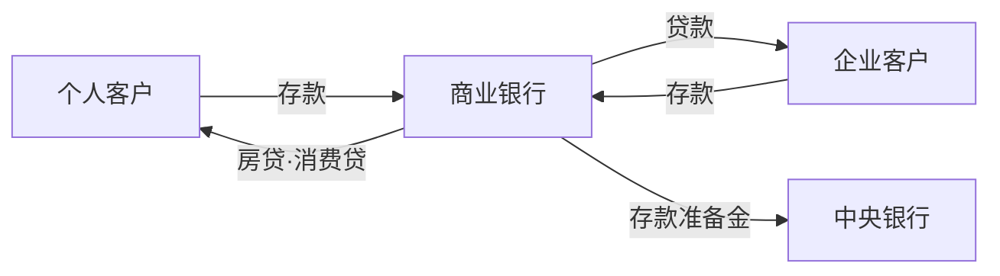
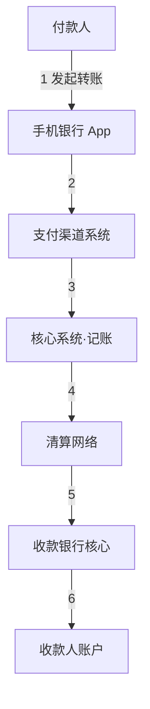

新进银行科技、金融 IT 的开发者，头一个月往往不是在写代码，而是在读文档：核心系统、信贷系统、渠道系统、前置系统……需求文档里全是「借据」「账务」「落地」「跑批」这样的词。技术栈再熟，业务模型不懂，代码就读不动——因为银行系统里的每一个类、每一张表，都是业务概念的投影。

这篇是银行业务系列的第一篇，不深入任何具体系统，只回答三个问题：银行是门什么生意？业务怎么分类？这些业务对应哪些系统？把这张地图立起来，后面每一篇讲具体业务时，都有处安放。

## 银行是门什么生意

一句话概括：**银行是经营资金和风险的金融中介**——用较低的利率把钱「买」进来，用较高的利率把钱「贷」出去，赚中间的利差。

这件事看资产负债表最清楚，而资产负债表正是银行业务一切分类的根源：

- **负债端**（钱从哪来）：储户的存款是银行欠储户的钱，在银行账上是负债；此外还有向同业借入的资金、发行的债券。
- **资产端**（钱到哪去）：放出去的贷款、买入的债券是银行持有的债权，在银行账上是资产。

资产端的利息收入减去负债端的利息支出，就是净利息收入——这是国内银行最主要的利润来源。两端利率之差叫**利差**，下图就是这个资金池：

普通的资金池生意，赚差价就够了；银行的特殊之处在于它经营的是**风险**：

- **信用风险**：借款人可能不还。贷款利率高于存款利率的部分，本质是风险溢价——先覆盖坏账损失，剩下的才是利润。为坏账提前计提的钱叫**拨备**。
- **流动性风险**：储户随时可能取钱，贷款却收不回来。所以监管要求银行缴纳**存款准备金**、保持流动性达标，挤兑是商业银行的头号噩梦。
- **市场风险**：利率一动，利差就动，持有的债券估值也动。

所以银行的核心能力不是「有钱」，而是识别和管理风险。这个认识会直接改变你对银行系统的看法：风控、授信、审批、额度这些概念在系统里无处不在，它们不是附属功能，而是业务本体。

## 业务的三种分法

银行业务有三种常见的切法，切口不同，用途不同。

### 按资金流向：负债、资产、中间

这是最贴近资产负债表本质的分法：

| 业务 | 钱的角色 | 典型例子 | 收入形式 |
| --- | --- | --- | --- |
| 负债业务 | 资金来源 | 活期与定期存款、同业拆借、发行同业存单 | 支付利息，是成本端 |
| 资产业务 | 资金运用 | 贷款、票据贴现、债券投资 | 收取利息，利润主力 |
| 中间业务 | 不动用自有资金 | 支付结算、代销理财基金保险、托管、银行卡手续费 | 收取手续费与佣金 |

负债业务是命脉：存款规模决定放贷能力，「拉存款」成为客户经理的核心 KPI，根源就在这里。资产业务是利润发动机，贷款是大头。中间业务不承担信用风险、几乎不占用资本，是监管鼓励银行转型的方向——你手机银行里能买到别家基金公司的产品，就是代销类的中间业务。

### 按客户维度：零售、对公、金融市场

- **零售业务**（面向个人）：储蓄卡、房贷、消费贷、信用卡、财富管理。单笔金额小、客户数量巨大，系统上的特点是高并发、海量账户、日终跑批。
- **对公业务**（面向企业与机构）：结算账户、流动资金贷款、项目贷款、贸易融资、现金管理、票据。单笔金额大、需求非标、审批链长，系统上的特点是工作流引擎、授信额度管控、多级审批。
- **金融市场业务**（面向金融机构）：同业拆借、债券交易、外汇、票据转贴现。交易属性强，系统上是另一套交易与估值的技术栈。

开发者要对这个分法格外敏感：**银行的部门架构和系统架构基本就按这三条线划分**。你进的是零售条线还是对公条线，决定了你面对哪套系统、哪类需求、什么样的并发模型。

### 按监管口径：表内、表外

表内业务进资产负债表——存款、贷款都在表内，每放一笔贷款都要按风险权重占用自己的资本，而资本是稀缺品，受**资本充足率**约束。表外业务不进表——担保承诺、代销、托管，但可能带来或有风险。

资本稀缺，银行就有动力发展不占或低占资本的表外业务；监管则要防风险积聚。理财从早年「保本、表外资金池」走向「净值化」，背后就是这条监管逻辑的博弈（资管新规）。这里先埋个伏笔，系列讲到理财时展开。

## 一笔转账背后的全景

把前面的概念串起来，看最常见的场景：你给朋友转 500 块，系统层面发生了什么。

几个关键点：

1. 手机银行是**渠道**，只负责交互，不碰账。
2. 账务落在**核心系统**：付款账户扣一笔、走一笔交易流水。
3. 跨行时，钱要通过**清算网络**流动——人民银行的大小额支付系统、网联、银联都在这张网里。这是整个支付体系最精华的部分，值得单独一篇，系列第二篇就讲它。

## 开发者视角的系统地图

业务分法最终会落到系统上。一张粗粒度的对应表：

| 业务 | 承载系统 | 典型形态 |
| --- | --- | --- |
| 存款与会计核算 | 核心系统 | 记账、账户、总账分户账，日终跑批 |
| 贷款 | 信贷系统 | 授信、审批工作流、借据管理、贷后管理 |
| 支付渠道 | 手机银行、网银、柜面、开放银行 | 只管交互，账务回落核心 |
| 清算 | 接口平台、支付系统 | 对接人行大小额、网联、银联 |
| 风控合规 | 风控、反洗钱系统 | 实时决策、名单筛查 |
| 理财资管 | 理财销售、资管系统 | 净值化估值、产品管理 |

其中**核心系统**是理解一切的锚点：它是银行的账本，所有业务兜兜转转，最后都落到核心记账。渠道系统原则上不碰账，只发起交易；会计才是各系统之间的通用语言——复式记账、借贷方向、科目与分户账，这些词会出现在每一份需求文档里。

多数开发者进银行科技，第一站是渠道或信贷，离核心比较远；但早点建立「一切系统尽头是核心和会计」的直觉，读起需求来会顺很多。

## 小结与系列路线

这篇把地图铺完：银行赚利差和手续费，本质是经营风险；业务按资金流向分负债、资产、中间，按客户分零售、对公、金融市场；这些业务对应核心、信贷、渠道、清算、风控几大系统。

系列后续计划：

- **支付与清算**：一笔钱怎么跨行流动——人行大小额、网联银联、清算与结算的区别。
- **信贷业务**：从授信到放款到不良——审批链、五级分类、拨备与贷后。
- **存款与账户**：Ⅰ Ⅱ Ⅲ 类账户、计息规则、为什么账户体系长这样。
- **理财与表外**：资管新规后的净值化世界。

欢迎追更。
