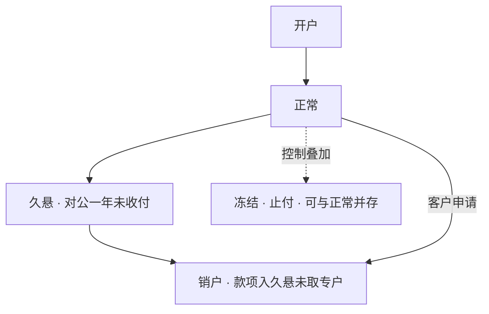

摘要：账户模型是核心系统组织客户资金数据的方式，其设计决定余额的正确性与交易控制的有效性。本文考察四个问题：账户由主档、余额与子户构成的方式；账户生命周期状态与收付控制位的关系，包括冻结、止付与久悬；账户与客户经由客户号及企业级客户信息整合系统（ECIF，Enterprise Customer Information Facility）的两层组织；以及账户分类监管在系统层的实现。分析表明，账户在系统中呈现为主档、状态机与控制位的组合结构，客户与账户的一对多组织则是全行客户统一视图的地基。

关键词：核心系统；账户主档；账户状态；久悬；客户信息

## 1 引言

前置篇将分户账定义为「每个账户的余额与状态」；本系列首篇《记账引擎》说明了账户如何挂于科目之下、余额如何随分录更新。本篇考察被这两句带过的主角本身：账户。问题有四个：账户由哪些部件构成；账户的生命周期与收付控制如何设计；账户归属于谁、如何与客户组织；以及账户分类监管如何在系统层落地。第 2 节讨论账户的构成，第 3 节讨论状态与控制，第 4 节讨论客户层，第 5 节讨论分类落点，第 6 节给出结论。文中示例均为示意，具体实现各行有所差异。

## 2 账户的构成：主档与子户

账户在系统中的起点是一份主档（account master）：账号、户名、币种、科目、计息标志、开户日期等开户要素的持久记录。余额通常与主档分离维护，随记账引擎的分录实时更新。主档加上余额，构成一个可收付的资金容器。

主档之下还可以开子户：同一账号下的细分记录，各有独立的余额与要素。以常见的定期一本通为例（示意）：一个定期账号之下，每笔定期存款是一个子户，各有本金、利率与到期日；活期账户亦可按钞汇设置子户。主档与子户的关系，工程上即一行主记录与其下的多行明细：账户模型不是一张表，而是一组带层次的表。需求文档中的「查子户」，指的就是这一层。

## 3 账户状态与收付控制

账户的治理由两个维度构成：状态与控制。状态描述账户的生命周期，控制描述收付的限制，二者可以叠加。

状态机的主干是：开户处理后进入正常，长期不动的账户转入久悬，最终销户。控制位则附加在状态之上：冻结分全额与部分，力度上有不收不付、只收不付之分；止付则停止对外支付。以司法冻结为例（示意）：法院要求冻结某账户 50 万元，账户保持正常状态，系统附加一条控制记录，超出冻结金额的部分仍可正常收付。常见控制位见表 1。

表 1　常见的账户控制位（示意）

| 控制位 | 含义 | 典型来源 |
| --- | --- | --- |
| 冻结（全额/部分） | 限制账户或部分资金的收付 | 司法机关 |
| 只收不付 / 不收不付 | 冻结的两种力度 | 司法机关、银行风控 |
| 止付 | 停止对外支付 | 挂失、风控 |

久悬是状态机上的一站。按照《人民币银行结算账户管理办法》，银行结算账户一年（含）以上未发生收付活动且未欠银行债务的，银行应通知存款人 30 日内办理销户；逾期未办理的视同自愿销户，未划转款项列入「久悬未取专户」管理[1]。系统层的表现是状态字段经日终批处理流转，这一机制属于日终批处理篇的范围。

图 1　账户状态与控制（示意）

收付控制是交易路径上的硬校验：记账引擎保证账目平衡，账户层保证这笔钱允许动。

## 4 账户与客户：两层组织

同一个人在一家银行往往同时持有工资卡、定期存单与房贷还款账户；系统必须知道它们属于同一人。这项工作由两层组织完成：客户号与 ECIF。

客户号是全行唯一的客户标识，在开户时建立，其前提是存款篇讲过的身份核实。一个客户名下可以开立任意多个账户，客户与账户是一对多关系：客户是身份实体，账户是资金容器。

ECIF（Enterprise Customer Information Facility，企业级客户信息整合系统）在此之上负责整合全行各系统的客户信息，形成单一客户视图[2]。其解决的典型问题是：客户信息散落在各业务系统中、同一客户在不同系统各有一个客户编号。工程上，ECIF 扮演客户主数据（master data）服务的角色；以客户为单位汇总资产（如管理资产规模口径）的数据，正是由客户号把账户聚合起来得到的。

## 5 账户分类的系统落点

存款篇从业务面讨论过账户分类；在系统层，分类的实现方式是属性字段加限额控制。

个人账户按 Ⅰ、Ⅱ、Ⅲ 类管理：类别是账户的属性，限额是交易时的控制位，即 Ⅱ 类户非绑定账户转入资金日累计 1 万元、年累计 20 万元，Ⅲ 类户余额 2000 元[3]，逐笔校验发生在交易路径上。对公账户分为基本、一般、专用、临时四类，同样是属性加收付范围控制：基本存款账户是唯一可以支取现金的类别，其余类别按用途限定收付范围。

分类监管因此不改变账户模型本身：Ⅰ Ⅱ Ⅲ 类与对公四类，都是主档上的类别属性与相应的限额、范围控制位。

## 6 结论

本文将账户模型拆解为三个部分：主档与子户构成账户的实体，状态机与控制位构成账户的治理，客户号与 ECIF 构成账户的归属组织；账户分类监管以属性与限额控制的形式落进同一模型。模型本身保持稳定，监管与业务的变化大多表现为属性与控制位的增删。

本系列下一篇将考察利息计算：资金的时间价值如何在系统中逐日计提，计息规则与结息安排如何落进日终批处理。第 2 节说过计息标志挂在主档上，利率与期限则记在子户上；利息计算恰好站在本篇与《记账引擎》的交界处。

## 参考文献

[1] 中国人民银行.《人民币银行结算账户管理办法》. 2003 年发布.

[2] 知乎专栏. 银行 ECIF 系统（Enterprise Customer Information Facility）.

[3] 中国人民银行. 个人银行账户分类管理相关通知.
