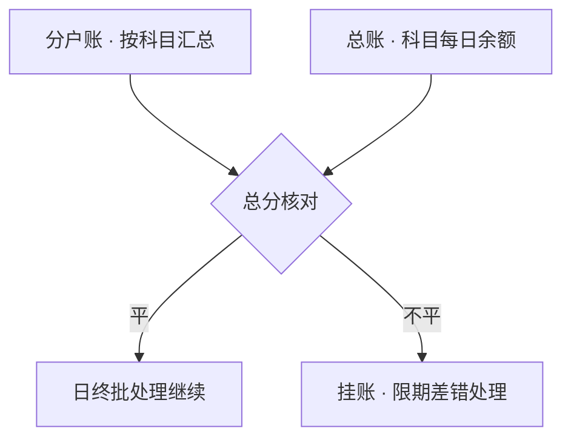

摘要：记账引擎是银行核心系统中负责会计核算的模块，其正确性直接决定对外报表与监管报送的可靠性。本文以《银行核心系统入门》确立的三层账本为起点，考察记账引擎的四个组成部分：以分录为基本单位的事务模型，以科目表为核心的账本组织，以内部户承接在途资金的过渡机制，以及处理差错的冲正机制与证明账目平衡的总分核对。分析表明，记账引擎的各组成部分与工程实践中的熟悉概念一一对应：分录即事实记录，冲正即补偿事务，总分核对即每日执行的平衡断言。

关键词：核心系统；复式记账；科目表；内部户；冲正；总分核对

## 1 引言

《银行核心系统入门》（下称前置篇）确立了核心系统的定义与三层账本结构：交易流水、分户账与总账。该篇回答的是「核心系统是什么」；本系列在此之上逐层下钻，回答「它如何构造」。本篇考察其中的第一组件，即记账引擎。

本文要展开的问题有四个：一笔账在引擎中以何种单位记录；上亿账户如何经由科目表组织成一张报表；不属于客户的资金停留在哪里；账记错之后如何更正，以及每日以何种方式证明账目平衡。第 2 节定义分录，第 3 节讨论科目表，第 4 节讨论内部户，第 5 节讨论错账更正，第 6 节讨论总分核对，第 7 节给出结论。文中示例均为示意，不对应任何真实机构的科目体系。

## 2 分录：记账的基本单位

前置篇以一笔 1 万元存款为例说明复式记账：银行收到的资金增加，储户的存款增加，两笔登记同时成功、金额相等。本节给出这两笔登记的准确形态。

会计上，每一笔登记称为一条分录（entry），包含日期、借贷方向、科目、金额、摘要与关联信息。一笔业务至少产生两条分录，借贷金额必须相等，此即复式记账的约束。以一笔柜台现金存款 1 万元为例（示意），分录如表 1 所示。

表 1　现金存款 1 万元的分录（示意）

| 方向 | 科目 | 金额（元） |
| --- | --- | --- |
| 借 | 库存现金 | 10,000 |
| 贷 | 吸收存款——活期储蓄存款 | 10,000 |

从工程视角看，记账事务与数据库事务的原子性要求同构：一个事务内的多条分录要么全部生效，要么全部回滚，且入库前执行借贷平衡校验。前置篇所说的「强制双写，且带平衡校验」，其准确含义即是如此。记账引擎的全部工作，可以概括为保证每一笔分录成对出现且全局平衡。

## 3 科目表：账本的骨架

上亿个账户无法直接汇总成一张资产负债表，中间需要一层归并维度，即科目（account title）。科目相当于一张全局枚举表，每个账户必须挂于某个科目之下；总账按科目汇总每日余额，对外报表直接取自总账。

科目表的设计包含两个要点。其一是级次：一级科目对齐对外报表，末级科目对齐内部管理，中间层级行业常见三四层（具体划分各行自定）。其二是科目性质：资产、负债、权益、损益四类，决定借贷方向：资产类增加记借，负债与权益类增加记贷；损益类科目则是利润表的直接来源，收入类科目余额在贷方，支出类在借方，期末结转（转入利润核算）后清零[1]。

科目表中还包含一类特殊科目：表外科目。担保承诺、承兑等待定事项虽然不进入资产负债表，但需要在账上登记备查；「表外」并非没有账，而是记在另一套科目里。这一设计与《理财与表外入门》讨论的表外业务直接对应。

科目表是全行共享的模式（schema），其变更牵动所有记账路径：前置篇曾指出改科目等于改 schema，需要全量迁移与审慎评估，原因即在于此。

## 4 内部户：系统的过渡科目

客户之外，银行还会以自身名义开立一批账户，称为内部户，典型用途是承接状态未明的资金。其存在解决一个问题：在交易的中间状态，资金不能悬空，也不能提前记入客户或对手的账户。

以一笔跨行汇款为例（示意）：客户转出 1 万元，本行核心当即借记客户存款账户；资金到达对方银行之前处于在途状态，贷方即记入「待清算往来」类内部户。次日收到清算对账文件，核对无误后再将内部户余额销清。若对账出现差异，差额停留在此类科目中，即前置篇所说的挂账。

内部户的工程含义接近缓冲区或暂存队列：它不是终态，必须有时限地清理。审计实践中，内部户余额的账龄是重点检查对象，长期挂账意味着某笔资金的状态未得到交代。

## 5 错账更正：冲正

交易流水只插入、不修改（append-only），由此产生一个问题：记错了怎么办。银行业按差错发现的时间区分两种处理。

当日发现的差错一般作抹账处理：撤销原交易，按正确方式重新记账。隔日发现的差错则通过冲正交易更正，不能直接改动原记录[2]。会计惯例上，更正采用红字冲销法：先以红字（即负向金额）编制一张与原错误分录内容相同的冲销分录，再以正常字色编制正确分录，即「先红冲，后蓝补」[2][3]。

从工程视角看，冲正即补偿事务（compensating transaction）：不修改历史，以一条新的反向记录抵消既有记录的影响。这一约束保证了流水可以重放：从任意起点逐笔累加，能够重建任意时点的账户余额与总账，这是审计与监管检查的基础。隔日冲正还需同步调整计息，使利息计算与更正后的账务保持一致。

## 6 总分核对：每日的平衡证明

前述机制保证了单笔事务的平衡；系统层面还需要每日证明总账与分户账彼此一致，这一步骤称为总分核对：将全部分户账按科目汇总，与总账的科目余额逐项比对。

以示意数量级说明其规模：账户数千万个，科目数百个，汇总后每日执行数百项比对。核对通过，日终批处理得以继续；出现差额，则将差异金额挂入相应内部科目，限期查清。前置篇提到的「对不平的差额就是挂账的来源之一」，其制度化的处理路径即在于此。总分核对因此构成日终批处理的第一道门禁，也是记账引擎每日执行的平衡断言。

图 1　总分核对流程（示意）

## 7 结论

本文将记账引擎拆解为五个组成部分：科目表提供账本的组织方式，分录承载事实记录，内部户承接在途资金，冲正以补偿事务的方式处理差错，总分核对每日证明总账与分户账一致。五者对应工程实践中熟悉的模式：枚举表、append-only 日志、缓冲区、补偿事务与断言；「复式记账是一致性协议」的判断，在组件层面得到展开。

本系列下一篇将考察账户模型：账户主档的构成、余额与状态的控制方式，以及客户与账户的组织关系。

## 参考文献

[1] 财政部.《企业会计准则——基本准则》. 2014 年修订.

[2] 财政部.《会计基础工作规范》. 1996 年发布，2019 年修订.

[3] 知乎专栏. 抹账、红冲、蓝冲、单边账等账务处理概念及应用实例. 2023. https://zhuanlan.zhihu.com/p/623523137
