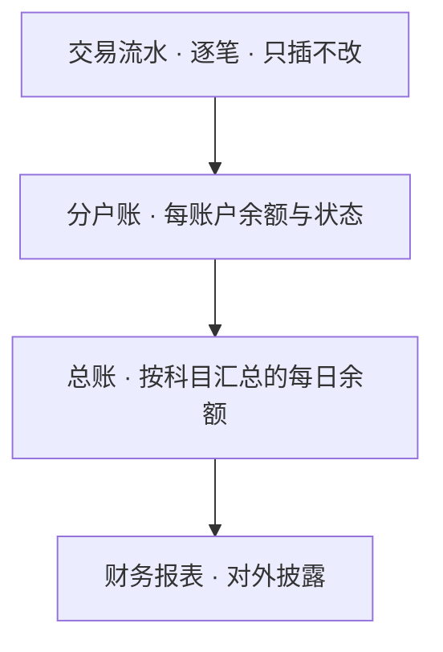
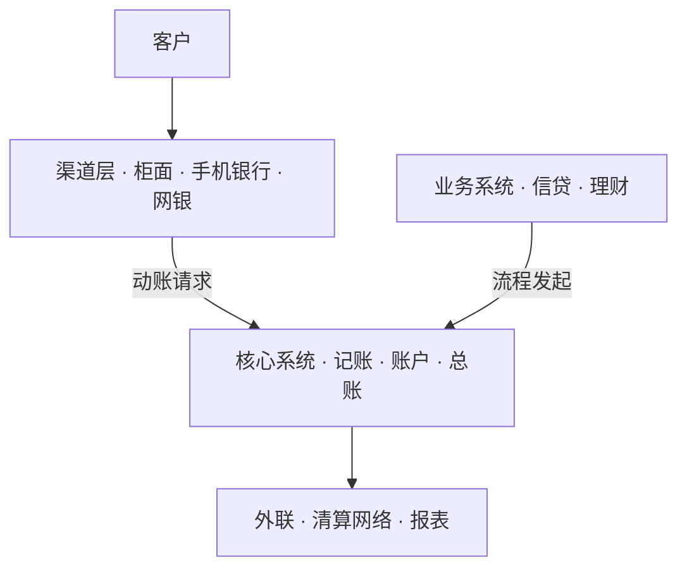

《银行业务入门》里有一句话：一切系统尽头是核心和会计。这篇兑现它：把镜头从业务推近到系统，看清承接一切业务的核心系统（core banking system）。材料取自行业通行结构与公开资料，不针对任何一家银行的内部实现。路线是：先认出核心，再跟一笔存款走一遍记账，然后拆开账本的三层结构，接着看银行的一天怎么过，最后看它和周围系统的分工。生词可随读随查[《银行业务术语速查》](/posts/banking-glossary/)。

## 几十套系统，哪一套是核心

一家全国性银行的 IT 系统动辄上百套：手机银行、网银、信贷管理、风控、报表、渠道前置。新人的第一个问题往往不是哪套最难，而是哪套是核心。答案不按规模排，按职责定：直接管理账户余额与会计核算的系统，就是核心系统。银行的每一笔资金变动，最终都要在核心落账；其余系统要么替它收单，要么加工它产出的数据。

英文里 core banking 的 core，业内常展开为 CORE，即 Centralized Online Real-time Exchange（集中式在线实时交换）。这是个事后补造的缩写词，倒是把职责说全了：集中、在线、实时地交换资金信息。研究机构 Gartner 的定义更朴素：处理银行每日交易的后端系统。

在系统架构图上，核心系统扮演操作系统内核的角色：渠道是外设，业务系统是进程，所有动钱的请求最终都要经过内核完成系统调用。核心未必是最大的那台机器，而是一组职责：账户、核算、总账。判断一套系统是不是核心，就看它是否直接改动这些数据。

## 一笔存款的系统之旅

跟随一笔最简单的业务走一遍：你在手机银行存入 1 万元。

手机银行是渠道，负责受理：核对身份、采集要素、展示结果，渠道不记账。动账请求随后送入核心系统，核心做两件事：先记流水，把这笔交易写进逐笔日志；再更新分户账，把这个账户的余额加上 1 万元。

会计层面，这 1 万元表现为两笔登记：银行收到的资金增加了，储户的存款也增加了。两笔同时成功、金额相等，这就是复式记账，即词典里说的「强制双写，且带平衡校验」：账不平，事务直接失败。

你在 App 里看到「余额更新成功」时，背后是一次穿过渠道与核心的完整会计事务；财报篇教你看的资产负债表，就是这类事务经年累月的沉淀。

## 为什么存款增加记「贷」

打开核心系统的数据字典，会撞上第一组黑话：借（debit）与贷（credit）。储户存款增加，方向记「贷」；银行收到的资金增加，方向记「借」。第一次见几乎都会误会：储户明明是把钱放进银行，怎么反而记「贷」？

原因在于，借和贷只是记账方向的两个符号，与「借钱」「信贷」没有关系。哪一边记增加，取决于账户的性质：资产类账户增加记借，负债与权益类账户增加记贷。回到那 1 万元：银行收到的资金是资产，增加记借；储户存款是负债，增加记贷。两边金额相等，会计恒等式「资产 = 负债 + 所有者权益」在每一笔分录上都成立。

把它当作符号约定就好，如同坐标系规定 x 轴向右为正，规定本身不需要道理，全行业统一才有意义。读核心系统的表结构或需求文档时，判断借贷方向先问账户性质，不要按生活语义猜。

## 一本账的三层

需求文档里还有两个高频词：科目余额、账户余额。它们不是一回事，差着一整层账本结构。

银行的账分三层。最底层是流水：逐笔交易的日志，只插入、不修改，记错了用反向交易冲正，即再插一条方向相反的记录。中间是分户账：每个账户的当前余额与状态，由流水逐笔累加而成，像一份物化的视图。最上层是总账：按科目汇总的每日余额，财报篇说过，它是资产负债表的原子构件。

科目是汇总的维度，相当于一张全局枚举表：「吸收存款——活期储蓄存款」是一个科目，全国数以亿计的活期账户都挂在它下面。三个数量级逐层收敛：账户数千万级，科目数百个，总账每天产出几百行（均为示意数量级）。

*下图为账本的三层结构。流水逐笔记录，分户账按账户物化余额，总账按科目汇总，对外报表直接取自总账。*

「查科目余额」去总账，「查某个客户的余额」去分户账；两层必须对得平，对不平的差额就是挂账的来源之一。

## 为什么银行的一天不从零点开始

凌晨零点刚过，你给朋友转了一笔钱；打开账户明细，这笔交易的会计日期可能仍是昨天。不是系统出错，是银行的「一天」有自己的边界。

核心系统按营业日记账，营业日的边界由日切（cutover）决定。人民银行的支付系统每天 16:00 前后日切（各系统时刻不同），日切之后的交易记入下一个营业日：9 月 30 日 16:01 发起的转账，会计日期可能已经是 10 月 1 日。计息、对账、报表，全部跟着会计日期走。

白天属于联机交易，逐笔实时；夜里属于日终跑批：计提利息与费用、生成对账文件、更新总账、季度结息（每季末月 20 日，存款篇讲过）。跑批的窗口和依赖管理远比一般夜间任务严格，失败是要凌晨拉人起来处理的事故。

会计日期是核心系统的「当前时间」；跨系统对数据时，先确认双方在同一个营业日里。

## 渠道为什么不能碰账

需求评审里的高频句：「渠道不碰账」「这笔交易要落地」。两句说的是同一套分工。

动钱的责任集中在三层：渠道系统管交互，柜面、手机银行、网银、开放银行（Open API）都在这一层；业务系统管流程，信贷审批、理财销售这类多步骤业务在这一层推进；核心系统管账，所有动账请求最终落到它这里集中处理。交易从渠道或前置真正写进核心账上，业内叫「落地」；没落地，就是钱还没真正动。

集中的理由是一致性：同一个客户在柜面、App、ATM（自动柜员机）看到的必须是同一个余额，计息与跑批也必须在同一本账上做。分散记账不是做不到，是对账成本与差错风险不可接受。

*下图为动钱链路的分层。渠道只做交互，业务系统管流程，记账集中于核心；箭头即动账请求的路径。*

评估任何新系统，先问一句它碰不碰账：不碰，就是渠道或流程层；碰，就得按核心的标准对待它。

## 换底座：从大型机到分布式

分层之外，底座也在变。大型银行陆续把核心从专用大型机迁移到分布式架构：邮储银行 2022 年投产的新一代个人业务核心，是大型银行中首个全量业务下移分布式平台的核心系统；农业银行 2025 年 4 月关停大型主机，完成银行业规模最大的一次切换。驱动因素大致有三：专用大型机高昂的采购与维护成本，关键技术自主可控的要求，以及互联网级并发对弹性扩容的需求。机器在换，分层没有变：变的是底座，不变的是账。

## 收官：一切系统的尽头是核心

第一篇的承诺到这里兑现。复式记账是核心系统的一致性协议，科目、分户账、总账是它的数据模型，会计日期是它的时钟，日终跑批是它的夜间任务；系列里讲过的每一笔业务（转账、放款、买理财）最终都化成核心里的一借一贷。

一句话总结：银行可以有一百套系统，但只能有一本真账；核心系统，就是守着这本真账的系统。

渠道、信贷、支付三大系统各自值得单独一篇，留作番外备选。词典继续按读者反馈增补，读到生词欢迎指出。
