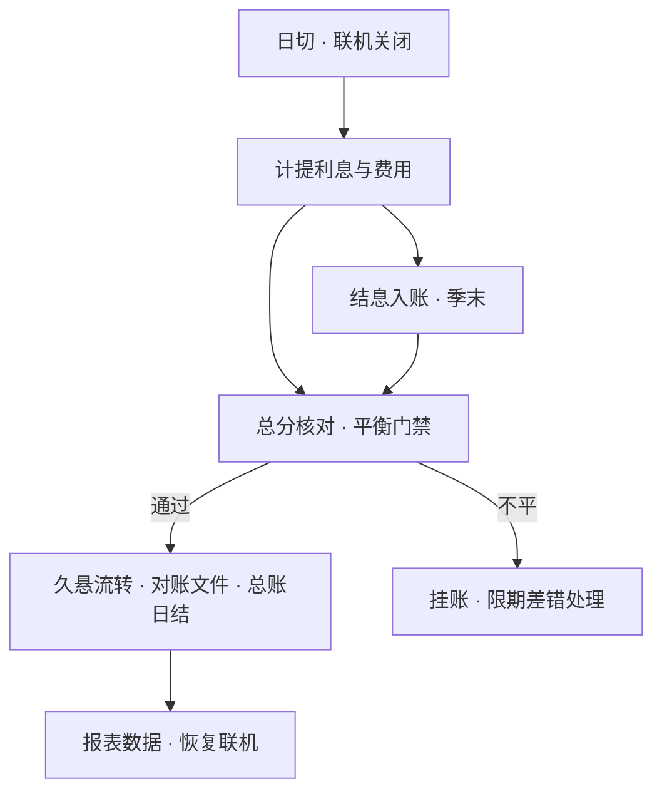

摘要：日终批处理是核心系统在联机交易平峰后执行的定时任务集合，前三篇讨论过的计提、总分核对与久悬流转都发生在其中。本文考察四个问题：批处理包含哪些任务、按什么顺序执行；执行窗口如何约束调度；任务失败后如何以断点重跑与幂等性保证安全恢复；以及在全天候服务已成行业现状的背景下，批处理承担的收敛角色。分析表明，日终批处理是账本的收敛点：它把联机时段持续产生的增量变化一次性收敛为确定状态，其顺序、幂等与窗口三项工程约束均源于账务依赖。

关键词：核心系统；日终批处理；调度；幂等；日切

## 1 引言

前三篇各留下一个批处理任务的线索：《记账引擎》的总分核对是「日终批处理的第一道门禁」，《账户模型》的久悬流转「经日终批处理进行」，《利息计算》的计提「每日日终」执行。本篇把这些任务收拢，完整地看一次银行的夜晚。

本文要展开的问题有四个：夜间运行哪些任务、按什么顺序；全部任务必须在多长的窗口内完成；任务失败后如何恢复，重跑为何不会重复记账；以及在服务全天候已成现状的背景下，批处理承担什么角色。第 2 节讨论任务与依赖，第 3 节讨论窗口与调度，第 4 节讨论断点重跑与幂等，第 5 节讨论全天候服务与收敛方式的关系，第 6 节给出结论。文中任务清单为行业通行结构的示意，具体实现各行有所差异。

## 2 任务清单与依赖

一次典型的日终批处理，任务大致按如下顺序执行：关闭联机或切换影子账（与日切衔接），计提利息与费用，季末结息入账，总分核对，久悬账户流转，生成清算对账文件，更新总账日结，准备报表数据，恢复联机。前置三篇的任务各就各位：计提属于账务计算，总分核对是平衡门禁，久悬流转是状态机推进。

任务之间存在严格的依赖：计提必须在日切之后（处理的是本营业日的最终余额）；总分核对必须在计提之后（利息科目也要参与平衡）；对账文件必须在总分核对通过之后生成（不平的账不能发出去）。这种「节点加边」的结构在工程上就是有向无环图：任务是节点，依赖是边，调度器按拓扑序执行。

图 1　日终批处理的任务依赖（示意）

依赖即顺序的来源：顺序不是编排偏好，而是账务因果：余额不确定则计提无据，平衡不成立则对账文件不可信。

## 3 窗口与调度

全部任务必须在批量窗口内完成：从日切到次日开门营业之间的小时级区间。窗口是一笔刚性时间预算：客户对「早晨开门即可正常使用」的期望不会放宽，而账户数与交易量逐年增长，任务却在同一个窗口内竞争时间。

调度由批处理调度器承担：任务按定时与依赖两种方式触发，前一任务的成功是后一任务的前置条件；任何任务失败，其下游全部挂起。前置篇说过批处理「失败是要凌晨拉人起来处理的事故」，机制上的原因即在于此：下游任务的时间预算随上游失败而收缩，人工介入越早，窗口损失越小。

## 4 断点重跑与幂等

任务失败后的恢复方式是从断点续跑，而非全部重来：小时级窗口耗不起整夜重算。断点恢复的前提是任务可分割：调度器记录每个任务的状态（待执行、执行中、成功、失败），恢复时只重跑失败任务及其下游。

重跑的安全性由幂等性保证：同一任务对同一数据执行多次，结果与执行一次相同。幂等缺失的后果以例 1 说明（示意）：计提任务于 02:00 完成，02:05 因下游任务失败需要恢复；若恢复时从头重跑计提，且不清理 02:00 那一轮已生成的计提分录，全行活期账户的利息将被记两次，账平与息准同时失守。批处理的通行做法是给每轮批处理编号（批次号或营业日期），任务执行前先清理本批次已生成的数据再重新执行，以状态表防止重复启动。对照《记账引擎》：分录事务保证单笔记账的原子性，批处理幂等保证任务级的可重放。两者的组合使整个夜晚的账务处理成为可重放的过程，这也是审计检查夜间处理的基础。

## 5 全天候服务下的收敛

联机服务的全天候是全行业的现状而非目标：小额支付系统全年无休，手机银行转账随时可用，客户早已习惯随时动账。值得考察的是支撑它的方式。

矛盾在于：批处理需要稳定的输入，计提与总分核对要连续运行数小时，期间参与计算的余额不能变动；联机服务需要持续可用，余额却随时可能被交易改动。一种通行的做法是影子分户账：日切时点起，账务在两套分户账上分离进行。一套定格于日切时点、供批处理专用的影子账，另一套是继续承接实时交易的账户。以例 2 说明（示意）：客户账户 23:59 余额 1 万元；00:00 日切，影子账定格；00:01 客户转出 200 元，实时账户变为 9,800 元，服务全程无感；凌晨的计提与总分核对对着影子账的 1 万元执行；批处理完成后，利息入账等批量结果合并回实时账户。客户看来账户从未关闭，账务却在夜间完成了整轮收敛。合并的复杂度在于处理重叠：批量期间实时账户又发生了交易，批量结果与增量交易需要在合并时保持一致。这一思路与数据库的快照隔离相同：批处理读快照，写入合并回当前版本；差别在于数据库自动完成，银行以应用程序与批处理调度实现。行业分析将这套机制的持续压力概括为财务报告延时、准点日切与批量性能瓶颈三类挑战[1]。

## 6 交易核算分离：收敛被摊平

新一代分布式核心则前进一步：将交易处理与会计核算分离。这一分离值得展开。交易记账回答「客户的资金动了多少」，实时、逐笔、面向客户视角；会计核算回答「这些变动在会计上意味着什么」，按会计规则把交易流水映射为正式分录，面向报表与监管。传统核心里两者在同一窗口完成，核算的主要工作量落在夜间批处理；分离之后，交易层保持全天候实时，核算层以准实时或微型批次异步收敛，两层解耦使各自的升级与扩容互不牵制。代表性实践如微众银行基于分布式架构提供的不间断服务，以及网商银行面向小额高频场景的全天候在线能力[2][3]。这一路线已有公开落地：上海银行建设的统一会计核算引擎，即以交易级大总账实现交易与核算的分离[4]。

在这条路线上，批处理并不消失，而是被摊平：从「夜间集中收敛」走向「持续增量收敛」，总账仍需按日产出确定的余额供报表使用。摊平的代价是合并点后移：核算与交易之间需要新的对账机制，任意时点的账务可审计性要靠流水重放与持续核对保证。对开发者而言，判断一个系统属于哪一代，看它的总账是夜里一次算清，还是全天持续收敛即可。

## 7 结论

本文将日终批处理概括为账本的收敛点：计提、核对、久悬、结息等任务按账务因果组成有向无环图，在小时级窗口内把联机时段的增量变化收敛为确定状态。顺序、幂等、窗口三项工程约束分别对应依赖、可重放与时间预算。理解了这一点，也就理解了为什么批处理改造是核心系统迁移中最重的工程：改变收敛方式，等于改变账本的时间结构。全天候服务是现状，它改变不了收敛本身，改变的只是收敛的节奏：从夜间一次，到持续增量。

本系列下一篇将考察核心与支付的交界：清算对账文件如何逐笔核对，长款与短款如何处理。

## 参考文献

[1] 腾讯云开发者社区. 银行核心系统批处理面临的挑战. 2022.

[2] 微众银行. 科技创新. https://www.webank.com

[3] 阿里云. 主机及 AS400 核心系统下移方案.

[4] 知乎专栏. 神州信息助力上海银行数字化转型，构建交易核算分离新型大总账. 2022.
