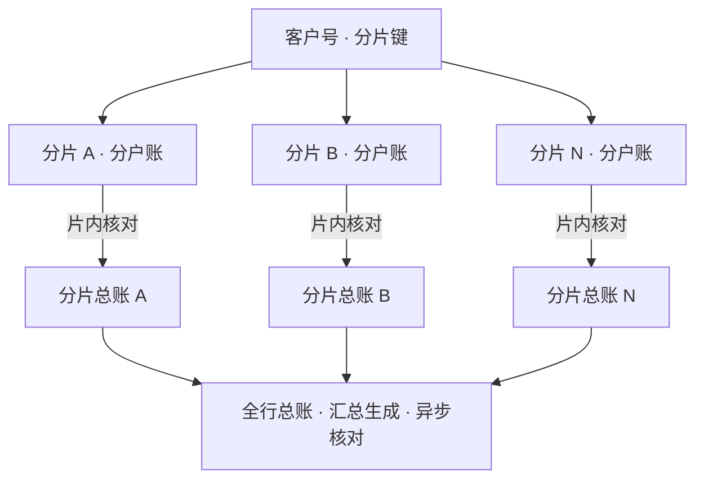

摘要：分布式架构是核心系统当前的主流演进方向：账本正从单一大型机迁移到由通用服务器组成的集群。本文考察四个问题：账本为何要分散；分散之后账务一致性如何保证；总分核对与对账赖以成立的「单一账本」前提如何重构；容灾形态如何变化。分析表明，分布式没有取消一致性，而是改变了它的实现位置：分片内部以多数派协议保持强一致，跨分片的最终一致由对账机制兜底；本系列此前各篇的机制（总分核对、对账、挂账与冲正）在分布式之下全部保留，只是执行位置从集中变为分布。

关键词：核心系统；分布式架构；分片；一致性；容灾

## 1 引言

底座的变化在前置各篇已两次露面：《银行核心系统入门》记载了邮储银行 2022 年首个全量下移与农业银行 2025 年关停大型主机，《日终批处理》第 6 节描述了交易与核算分离的路线。本篇正面考察底座本身：账本分散之后，系列此前的机制如何安放。

本文要展开的问题有四个：账本为何要分散；分散后每笔账务的一致性如何保证；「单一账本」前提下的总分核对与对账如何重构；容灾形态如何变化。第 2 节讨论分散的动因，第 3 节讨论切分与一致性，第 4 节讨论一致性机制的重构，第 5 节讨论容灾，第 6 节给出结论。所述架构模式为行业通行结构，各行实现存在差异；变化仍在进行中，以写作时点（2026 年 10 月）的公开资料为准。

## 2 为什么要分散

集中式大型运行银行核心数十年，其约束有二。其一是垂直扩展的边界：单机的处理能力与扩展空间有限，而账户与交易量逐年增长，峰值场景（节假日、营销活动）要求容量按天级弹性伸缩，单机无法供给。其二是成本与供应：专用大型机的采购与维护成本高昂，且供应与技术演进受制于单一厂商；前置篇提到的两大行切换，动力正在于此。

分布式架构的答案是水平扩展：以大量通用服务器组成集群，容量不足即增加节点，单点故障由冗余节点承接。这一路线的原生实践来自互联网银行：2015 年开业的网商银行将全部核心系统运行于分布式数据库 OceanBase 之上，成为首个把分布式数据库用于银行核心账务系统的银行[1]；传统银行的下移随后展开，南京银行以分布式数据库承接「鑫云+」互金平台核心业务，成为城商行梯队的标杆案例[2]；交通银行的新一代贷记卡核心则一步到位迁移至「云 + 分布式数据库 + 单元化」架构[1]。行业规模正在形成：主要分布式数据库厂商已服务上百家银行的数百套核心系统[1]。

## 3 账本的切分与一致性

分散的第一步是切分。账本按客户维度划分为分片：每个客户的账户与分户账归属某一分片，划分依据通常是客户号的哈希。《账户模型》的客户号在此处显现出第二重身份：它本来就是为了在全行范围内唯一标识客户而设计的，天然可用作分片键。

分片内部的一致性没有打折。主流分布式数据库以多数派协议（Paxos、Raft）保证分片数据：每笔分录必须写入多数节点并达成一致，才算成功。账务的「成功」因此从单机事务提交变为多数派确认，代价是写入延迟略有增加，收益是任意单节点损坏不丢数据。

跨分片的交易则需要协调。一笔转账若两端客户分属不同分片，涉及两个分片的原子变更；两阶段提交之类的刚性协议性能代价高，业界主流是柔性事务：先完成本方记账，再驱动对方步骤，失败即补偿，补偿在账务上的形态正是《记账引擎》第 5 节的冲正。柔性事务的窗口内两端状态可能短暂不同，即最终一致；不一致的窗口由谁收口，答案已在上一篇：对账。

在此之上，大型银行普遍引入单元化：把一组分片连同为其服务的应用栈绑定为一个单元，交易尽量在单元内闭环，跨单元交互压缩到最少；容灾时以单元为单位整体切换。「单元」可以理解为「小型的整行核心」：全行账本由数十个单元拼成，每个单元五脏俱全[1]。

## 4 一致性机制的重构

单一账本的前提被打破之后，系列此前的机制并没有失效，而是被移到了新的位置。

总分核对从一级变为两级。分片内：每个分片拥有自己的分户账与分片总账，核对在分片内执行，频率可以高于夜间：数据量小，准实时核对成为可能。全行级：总账由各分片的汇总异步生成，汇总核对允许滞后于分片核对。核对的总分结构不变，变化在于它从「一次大核对」变成「多次小核对加一次汇总」。

对账从行间扩展到片间。一笔跨分片转账，两端各记半边，结构上与上一篇的跨行单边账完全同构，对账机制原样适用：编号匹配、归并比对、差错挂账。柔性事务的补偿失败，最终也落入挂账与差错流程。分布式的世界没有发明新的账务纪律，它只是让《记账引擎》与《对账》的机制跑得更勤。

图 1　分片化账本与两级核对（示意）

## 5 容灾

容灾形态随底座一同演变。集中式时代的标准形态是两地三中心：一个生产中心、一个同城灾备中心、一个异地灾备中心，同城复制用于机房级故障，异地复制抵御区域级灾难[3]。按现行监管规范，银行核心系统的灾难恢复能力最低应达到第五级，即 RPO 为 0 至 30 分钟、RTO 为数分钟至两天[4]。

分布式架构把容灾从「备」推进到「活」。多数派写入天然要求节点分布在不同机房乃至不同城市：同城双活让两个数据中心同时承载业务，故障时以流量调度替代启停灾备；更进一步的三地五中心异地多活，可抵御城市级灾难而服务不中断[3]。两种形态的对比见表 1。

表 1　容灾形态对比（示意）

| 形态 | 布局 | 故障时的动作 | 数据特征 |
| --- | --- | --- | --- |
| 两地三中心 | 生产 + 同城备 + 异地备 | 启用灾备，主备切换 | 同城可零丢失，异地取决于复制方式 |
| 同城双活 | 同城两中心均读写 | 流量调度 | 多数派确认，零丢失 |
| 三地五中心 | 三城五中心异地多活 | 城市级流量调度 | 多数派确认，零丢失 |

RPO 趋向于零，是分布式带来的实质变化：多数派确认的语义本身就是「数据已在多数节点落定」，容灾能力由协议给出，而不再依赖灾备演练的临场发挥。

## 6 结论

本文将分布式架构概括为一致性实现位置的迁移：分片内部以多数派协议保持强一致，跨分片以柔性事务与对账维持最终一致；总分核对变为分片核对加汇总核对，容灾从主备切换变为流量调度。系列此前的机制（分录、冲正、挂账、总分核对、对账）全部保留，执行位置从集中变为分布。前置篇说「银行只能有一本真账」，分布式给它加了修订：真账被切成上百片，每一片都是真的，全行视角的真账是各片收敛后的汇总。

本系列下一篇是收官之作《年终决算》：一年之中最大的一次收敛与核对，全行如何共同完成。

## 参考文献

[1] OceanBase 社区. OceanBase 发展历史与客户案例（网商银行、交通银行）.

[2] 阿里云. OceanBase 知名企业客户成功实践案例：南京银行「鑫云+」互金平台.

[3] 中国信息通信研究院. 金融级数据库容灾备份技术报告.

[4] 达梦数据库. 基于主备集群技术的两地三中心解决方案. 2024.
