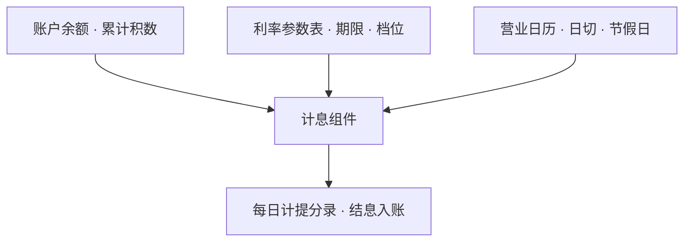

摘要：利息计算是核心系统中把时间引入账本的组件：余额是时点量，利息是时段量，系统以每日计提将时段切成时点。本文考察四个问题：活期与定期分别适用的两种计息方法；年利率折算为日利率的三百六十天惯例；计提与结息的分离及其会计含义；逾期后的罚息与复利。分析表明，利息计算在系统层是一个每日执行的批处理组件，输入为账户余额、利率参数表与营业日历，输出为分录；规则变化通常以参数配置而非代码修改的方式落地。

关键词：核心系统；积数计息；日利率；计提；罚息

## 1 引言

前置两篇各留下一个接口：《账户模型》第 2 节指出计息标志挂在账户主档、利率与期限记在子户；《记账引擎》建立了分录的事务模型。本篇考察两者之间缺失的一环：这些字段如何被一个每日执行的组件消费，变成账上的利息。

本文要展开的问题有四个：利息按什么公式计算；年利率如何折算为日利率；利息何时入账，计提与结息如何分离；逾期之后罚息与复利如何计算。第 2 节讨论两种计息方法，第 3 节讨论折算与计提，第 4 节讨论罚息与复利，第 5 节讨论系统实现要点，第 6 节给出结论。文中利率与金额均为示意；利率规则正处于修订过渡期，第 4 节专述其状态。

## 2 两种计息方法

活期账户的余额每天都在变动，定期与贷款的期限在合同中确定，两类场景对应两种计息方法[1]。

活期适用积数计息法：按实际天数每日累计账户余额，利息等于累计计息积数乘以日利率，其中累计计息积数为每日余额的合计数。以例 1 说明（利率与金额均为示意）：某活期账户 9 月 1 日余额 10 万元，9 月 3 日存入 5 万元，9 月 5 日日终时累计计息积数为 10 万元 × 2 天 + 15 万元 × 2 天，即 50 万元·日；按年利率 0.35% 折算日利率约为 0.0010%，积息 4.86 元。余额每变一次，只影响之后的积数；结息日按累计积数一次计算支付。

定期与贷款适用逐笔计息法：计息期为整年（月）的，利息等于本金乘以年（月）数再乘以年（月）利率。以例 2 说明（示意）：1 年期定期存款 10 万元，年利率 1.10%，到期利息为 1,100 元。

两种方法的工程含义不同：积数计息是增量维护，每日日终把余额累加进积数，把计算摊平到每一天，适合余额不确定的海量活期账户；逐笔计息是到期一次性计算，适合期限确定的定期与贷款。一次一计与日积月累，分别匹配了两类业务的时间结构。

## 3 折算与计提

日利率由年利率除以三百六十折算，月利率为年利率的十二分之一[1]。日历上有闰年的三百六十六天，行业惯例不作调整：三百六十是会计折算基数，不是日历天数。这一惯例在《存款与账户入门》已从业务面说明，此处是其系统落点。

计息与付息在时间上分离。按照权责发生制，利息随时间逐日产生：存款利息是银行的费用，贷款利息是银行的收入，不待实际支付即按日记入损益与应付利息科目，这一动作称为计提；到结息日（活期存款每季末月 20 日）才将应付利息实际转入客户账户，这一动作称为结息。两者的差异见表 1。

表 1　计提与结息的分离（示意）

| 动作 | 频率 | 会计含义 | 系统层 |
| --- | --- | --- | --- |
| 计提 | 每日（日终批处理） | 权责发生：确认当期费用或收入 | 记入应付利息科目 |
| 结息 | 每季末月 20 日等 | 实际支付：负债转为客户余额 | 生成入账分录 |

计提是批处理，结息是分录生成，两者都在日终窗口完成；本篇给出其会计逻辑，调度与依赖留待下一篇展开。这里也回答了《记账引擎》第 5 节留下的问题：隔日冲正为何要同步调整计息。利息按积数累计，余额的任何更正都改变其后的积数，账与息必须一起更正。

## 4 罚息与复利

贷款逾期后，利率规则从合同利率切换到罚息利率。现行规则为：逾期贷款的罚息利率在借款合同载明的贷款利率水平上加收百分之三十至百分之五十；挪用贷款的加收百分之五十至百分之一百；自逾期或挪用之日起按罚息利率计收利息，直至清偿本息[2]。对不能按期支付的利息计收复利，即对利息再计息：贷款期内的欠息按合同利率计收复利，逾期后改按罚息利率计收[2]。

利率规则正处于过渡期，需注明时点：2026 年 6 月，中国人民银行就《人民币存贷款利率管理规定（征求意见稿）》公开征求意见，拟取消逾期与挪用罚息的刚性上浮区间，改由借贷双方协商确定，计息基准亦拟改为按实际天数；截至本文写作，该规定尚未正式施行[3]。

对系统而言，这类变化通常不触及代码：罚息上浮比例、计息基数等在系统中配置为利率参数表与公式版本，规则修订的落地是参数调整与双轨试算，而非程序改造。参数化正是计息组件应对监管变化的方式。

## 5 实现要点

计息组件的输入有三：账户余额及其变动（或累计积数）、利率参数表（期限、档位、浮动点）、营业日历（日切边界与节假日安排）。三者的一致性决定利息的正确性：利率查错、日期越界、积数漏算，是计息差错的三类常见原因（见图 1）。

图 1　计息组件的输入与输出（示意）

正确性的验证机制有二。其一，账户模型篇的总分核对同样约束应付利息科目；其二，重要系统升级前以新旧引擎对同一数据双跑比对，业内称为利息试算；其角色与软件工程中的回归测试相同：不证明新引擎正确，只证明其行为与旧引擎的差异都可解释。

## 6 结论

本文将利息计算拆解为四件事：积数与逐笔两种方法，分别匹配余额不定与期限确定的业务；年利率按三百六十天折算的会计惯例；计提与结息在权责发生制下的分离；罚息与复利的参数化规则。分析表明，利息计算把时段切成时点、逐日记入账本，账本由此从存量记录升级为含时间维度的系统。

本系列下一篇将考察日终批处理：计提、总分核对、久悬流转都发生在夜里，下一篇把这些夜间任务收拢为一次完整的银行「一天」。

## 参考文献

[1] 中国人民银行. 关于人民币存贷款计结息问题的通知. 2005 年发布.

[2] 中国人民银行. 关于人民币贷款利率有关问题的通知（银发〔2003〕251 号）. 2003 年发布.

[3] 中国人民银行. 人民币存贷款利率管理规定（征求意见稿）. 2026 年 6 月发布.
