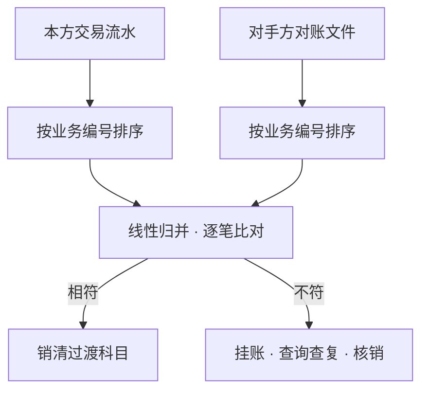

摘要：对账是核心系统与外部系统之间的一致性机制。《记账引擎》的总分核对保证行内总账与分户账一致；跨机构的一致性则由对账保证。本文考察四个问题：跨机构差错为何不可避免；对账核对什么；差错分为哪些类别、如何处理；对账在系统中如何实现。分析表明，每家机构只掌握交易链条中自己那一半的记录，单边账是分布式协作的常态而非故障；对账以逐笔勾对与余额核对将多套独立账本联成可信赖的整体，过渡科目则是差错处理的中转站。

关键词：核心系统；对账；单边账；长款；短款；差错处理

## 1 引言

前置各篇已三次触及对账的边缘：《银行核心系统入门》提醒「跨系统对数据时，别假设大家在同一个营业日里」；《记账引擎》的跨行汇款例子中，资金次日「收到清算对账文件，核对无误后再销清」；《日终批处理》的任务清单里有「生成清算对账文件」一项。本篇正面考察这一机制。

本文要展开的问题有四个：跨机构的账务差错为何不可避免；对账核对什么；差错有哪些类别、如何处理；对账在系统中如何实现。第 2 节分析单边账的成因，第 3 节讨论对账的两个层次，第 4 节讨论差错分类与处理，第 5 节讨论实现要点，第 6 节给出结论。文中场景均为示意，具体规则以各清算机构规定为准。

## 2 单边账：分布式协作的常态

对账之所以必要，根源在于每家机构只掌握交易链条中自己那一半的记录。一笔跨行转账，本行记「已扣客户账、已发出报文」，对方行记「已收到报文、已入客户账」。两个记录各自完整，合起来才是全貌，而没有任何一方天然拥有全貌。

报文在网络上送达不等于账务成功，两端的状态因此可能不同步：本行已扣账而报文滞留途中，对方行已入账而回执丢失，超时重发使两端各记一次。一方存在的记录在对方找不到对应记录，即为单边账[1]。成因可归为三类：时间差（交易跨日切，两端处于不同营业日）、状态不同步（一端成功一端失败或超时）、数据不一致（两端都有记录但金额或要素不符）。

需要强调的是，单边账不是故障，而是多套独立系统协作的常态，正如分布式系统中节点间的消息可能迟到、丢失与重复。常态化的现象需要常态化的治理机制，这就是对账。

## 3 对什么：两个层次

对账核对两个层次。其一是明细对账，即逐笔勾对：将本方交易流水与对手方出具的对账文件按业务编号匹配，逐笔核对金额与状态。对手方是谁，取决于交易走的是哪条路：跨行汇兑以人民银行大小额与网上支付的清算机构出具清算文件，银行卡交易以银联或网联的对账文件为准。对账文件本质上是「对方视角下的本方账单」。支付清算篇讲过清算与结算的区别，此处不再展开。

其二是余额对账，即资金对账：将本方在对方处应存的头寸与对方出具的实际余额核对。明细对账保证每一笔都对得上，余额对账保证总体资金相符；明细不平余额必然不平，余额对账因此是明细对账之后的全量校验。

以例 1 说明一次完整的对账（示意）：本行某日向他行汇出十笔款项，均借记客户账户、贷记「待清算往来」内部户；次日清晨收到清算文件，系统将十笔流水与文件逐笔勾对，九笔完全相符，自动销清对应的内部户分录；一笔金额不符，转入差错处理。

## 4 差错分类与处理

勾对后不符的记录进入差错处理。差错按两边的记录情况分类，见表 1。

表 1　对账差错的分类（示意）

| 情形 | 名称 | 典型成因 |
| --- | --- | --- |
| 实收资金多于本方账面 | 长款 | 对方重复入账；客户重试但首笔实际成功 |
| 实收资金少于本方账面 | 短款 | 对方掉单；回执丢失 |
| 两边都有记录但不符 | 金额或要素差错 | 一端金额改写；要素缺失 |

差错处理是一条固定流程：先将差异金额挂入过渡科目，再向对手方发出查询，待对方查复后调账核销，确认收益或损失，或向对手方、客户追回[2]。长款与短款的成因分析见行业实践总结[3]。挂账正是《记账引擎》第 4 节内部户的职责：待清算往来类科目承接状态未明的资金，账龄是审计重点，机制上的用意即在于此：差错没有查清之前，资金不允许悬空，也不允许贸然归属。

图 1　逐笔勾对的归并匹配（示意）

## 5 实现要点

对账在系统中的实现有三个要点。其一，对账本身也是批处理：T+1 日收到对账文件后执行，与日终批处理衔接：《日终批处理》的图 1 中「生成清算对账文件」与对侧机构的对账互为镜像，同一天的账在两端各被核对一次。

其二，勾对的算法即是排序与归并：双方流水各按业务编号排序后线性扫描比对，工程上与数据库的合并连接同构。编号体系由此成为对账的前提：流水号、订单号、清算日期在报文设计中必须全局唯一且两端一致，否则勾对无从谈起。

其三，差错处理受时限约束：查询查复的时效、核销的审批权限，各清算机构均有明确规定，系统以差错台账跟踪每一笔未决差错的状态与账龄。时限的意义与前篇的窗口相同：未决差错占用过渡科目，账龄越长，风险敞口越大。

## 6 结论

本文将对账概括为跨机构的一致性机制：单边账源于多方各记半边账的协作常态；明细勾对与余额核对两个层次将独立账本联成整体；差错按长款、短款与不符分类，经挂账、查询、核销的固定流程处理。行内的一致性靠总分核对，行间的一致性靠对账；两套机制加上作为缓冲区的过渡科目，共同构成账本可信赖的完整闭环。

本系列下一篇将考察分布式架构：当账本本身分散在数百个节点上存储时，总分核对与对账赖以成立的「单一账本」前提如何重构。

## 参考文献

[1] 知乎专栏. 一文搞懂「对账系统」：单边账与补单.

[2] 腾讯云开发者社区. 支付对账差错处理与长短款核销.

[3] 博客园. 支付对账一些事：长短款成因详解.
