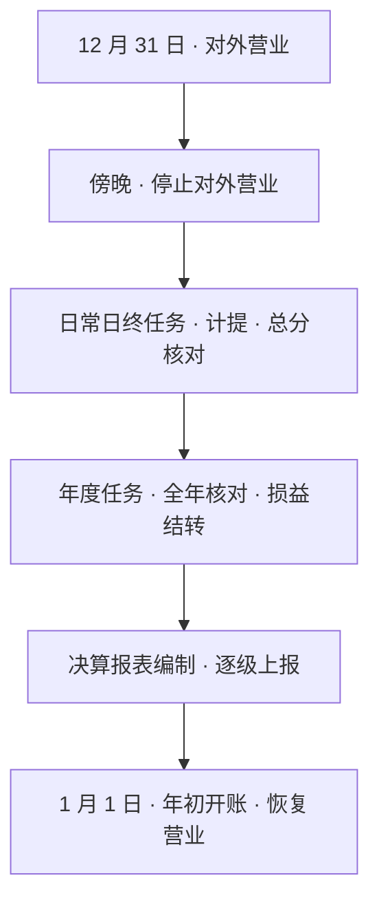

摘要：年终决算是核心系统一年中最大的一次收敛与核对：每年 12 月 31 日，全行在一个延长的批处理窗口内完成全年账务的最终确认。本文考察四个问题：决算日与普通日终有何不同；一年的损益如何在账上归零重来；决算报表从哪里来、到哪里去；决算形态经历了怎样的变迁。分析表明，年终决算不是新机制，而是本系列此前各篇机制的一次年度汇总：分录、计提、对账、核对都在这一夜收敛到年度粒度；决算产出的报表正是《银行财报入门》中资产负债表与利润表的源头。

关键词：核心系统；年终决算；损益结转；决算报表；年初开账

## 1 引言

上一篇结尾说，年终决算是「一年之中最大的一次收敛与核对」。本篇兑现这个说法，也为本系列收官。

本文要展开的问题有四个：决算日的昼夜如何安排，它与日常日终的差异在哪里；一年的损益如何在账上结平归零；决算报表从哪里来、到哪里去；决算的形态经历了怎样的变迁。第 2 节描述决算日的停业与备战，第 3 节描述决算夜的任务，第 4 节讨论损益结转，第 5 节讨论决算报表，第 6 节讨论形态变迁，第 7 节给出结论并总结全系列。文中流程为行业通行结构，各行实现存在差异。

## 2 决算日：停业与备战

银行以公历年度为会计年度，每年 12 月 31 日为决算日[1]。这一天从傍晚起就与平日不同：柜面缩短对外营业时间，停止对外营业后，网点开始内部轧账；部分电子渠道服务也有临时调整。

对外的安静对应着对内的忙碌。决算的准备工作更早，12 月下旬即已展开：清理挂账与未达账项，对账篇的差错台账在年末必须压降；核对全年利息计提，利息计算篇的积数与分录在此最终确认；处置久悬账户，账户模型篇的状态机在年末执行。决算并非一个通宵就能完成：数百万银行人参与的这一年终传统，通常要提前数周备战[1]。

## 3 决算夜：日常任务与年度任务的叠加

夜间的决算批处理，是日常日终的叠加版：日常任务照常执行，即计提、总分核对、总账日结；年度任务在其上叠加，即全年数据核对、损益结转、新旧年度科目结转。分支行的决算数据逐级汇总上报至总行，总行完成全行决算后向中国人民银行报备；中国人民银行在 1 月 1 日早间宣布决算完成。这通常是这家机构新年发布的第一条消息：决算完成本身，就是中国银行业的新年事件[1]。

图 1　决算夜的流程（示意）

## 4 损益结转：账上的一年如何归零

一年的经营成果最终要在账上落定，这个动作称为损益结转。损益类科目（各项收入与支出）在年内持续积累：收入类科目余额在贷方，支出类科目余额在借方。年度终了，两类科目分别结转至「本年利润」科目：收入类借记结平、贷记本年利润，支出类贷记结平、借记本年利润[2]。结转之后，「本年利润」的贷方余额即全年净利润，借方余额即净亏损。

「本年利润」随后结转至「利润分配」科目，结转后本年利润科目无余额[3]。账上的一个会计年度就此归零，来年重新开始。利润分配连接着所有者权益：分红与留存都在这里落账，《银行财报入门》读到的权益行，年终的变动正源于此。

表 1　损益结转的示意分录

| 步骤 | 借方 | 贷方 | 说明 |
| --- | --- | --- | --- |
| 结转收入类科目 | 各收入类科目 | 本年利润 | 收入类余额在贷方，借记结平 |
| 结转支出类科目 | 本年利润 | 各支出类科目 | 支出类余额在借方，贷记结平 |
| 结转本年利润 | 本年利润（盈利时） | 利润分配 | 结转后本年利润无余额 |

以系列的语言复述：损益类科目是利润表的原子构件（记账引擎篇的科目分类），全年六千多亿的利息收入由每一笔计提分录积累而成（利息计算篇），结转分录把它们一次归拢，聚合出的净利润就是财报篇利润表的最后一行。账上的一年，从第一笔分录到损益归零，闭合为一个循环。

## 5 决算报表：账本的年度出口

决算的直接产出是决算报表：全行业务状况报告与损益明细等，逐级汇总后形成全行的年度决算报告。它与财报篇的关系是源头与下游：上市公司年报中的资产负债表与利润表，其数据正出自决算账；审计师核对的对象，就是决算夜产出的这套账表。财报篇说「财报是记账系统的下游」，决算夜是这条流水线一年中最繁忙的一班。

分布式架构在这一夜也有它的交代：全行账本分散在数百个分片上，年度汇总核对把各分片的片内核对升级为全行确认。《日终批处理》说「总账仍需按日产出确定的余额」，决算日是这句话的年度形态。逐级上报的传统组织形态与分片汇总的分布式形态，在决算夜汇合同一种东西：全行唯一确定的年度数字。

决算完成后，系统执行年初开账：新年度科目初始化、日期切换，1 月 1 日恢复营业。会计年度的轮回，在系统里表现为一批初始化作业。

## 6 形态变迁

决算的组织形态经历了完整的变迁。早年手工记账的时代，决算意味着「手打算盘、手工记账、全员参与、通宵达旦」；如今数智化接管了绝大部分对账与编表工作，决算夜的紧张从手工核对转为系统保障[4]。变迁的是手段，不变的是决算作为账本年度闭环的地位。批处理可以摊平（日终批处理篇），总账可以持续收敛（分布式架构篇），但会计年度的法定划分、利润的年度分配、审计的年度周期，都决定了年度决算仍是一个明确的动作；它与日终批处理篇的判断在年度粒度上再次成立：收敛的节奏可以变，收敛本身不变。

## 7 结论：系列的收官

本文将年终决算概括为前六篇机制的年度汇总：全年分录在此最终平衡（记账引擎），挂账与差错在此压降（对账），利息计提在此落定（利息计算），决算批处理是日终批处理的年度放大，全行汇总核算是分布式核对的总装；损益结转让账上的一年归零重来，产出的决算报表长成年报，交到《银行财报入门》的读者手中。

至此本系列完结。七篇的路径回头看来是一条线：记账引擎讲账怎么记，账户模型讲记在哪个户，利息计算讲时间怎么计价，日终批处理讲一天怎么收，对账讲跟别人怎么对，分布式架构讲账本放在哪里，年终决算讲一年怎么合。前置篇说，一切系统尽头是核心和会计；这个系列把「核心」两个字拆到了底：它不是一台机器，而是一套让亿级账户每日平衡、每年闭合的机制。

银行可以有一百套系统，但只能有一本真账；这本真账每天夜里收敛一次，每年岁末闭合一次。系列正文至此完结，支线（渠道、信贷、支付三大系统的单篇）留待日后提笔。词典继续按读者反馈增补，读到生词欢迎指出。

## 参考文献

[1] 央视新闻. 银行年终决算究竟有多拼？并非一个通宵就能搞定. 2020.

[2] 会计百科. 结转损益.

[3] 厦门大学会计发展研究中心. 会计科目和主要账务处理：本年利润.

[4] 上海市地方金融监督管理局. 告别 2024 迎接 2025——上海银行业年终决算奏响跨年新章. 2025.
