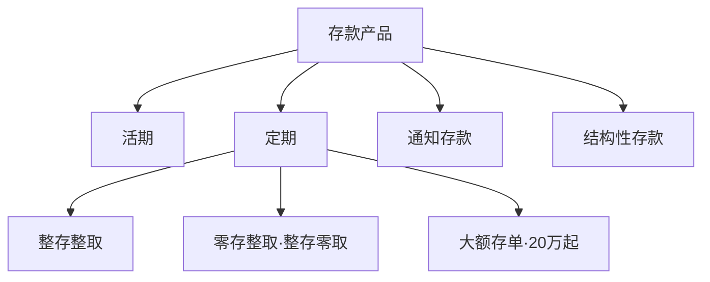

回到负债端。《银行业务入门》里说存款是银行的命脉，「拉存款」是客户经理的核心 KPI；《银行业务术语速查》里，流水到总账那条物化链也画过。这篇拆开命脉本身：存款这门产品长什么样、账户这个载体怎么分类、利息怎么算。账户是银行科技里最底层的数据结构——所有系统最终都在读写它。

生词随读随查配套的[《银行业务术语速查》](/posts/banking-glossary/)。

## 存款不是账户

两个概念先掰开：**存款**是产品，是银行欠储户的一笔债，约定了利率、期限、计息方式；**账户**是载体，记录这笔债的归属和变动。类比的锚点：存款是数据，账户是持有数据的对象——一个客户可以有多个账户，一个账户可以先后承载多笔存款（比如定期转存）。

产品谱系一张图：

- **活期**：随存随取，利率最低，但承担了支付结算功能——你的转账、消费都从这里走。
- **定期**：整存整取是主流，约定期限利率更高；**大额存单** 20 万起投，利率更优。
- **通知存款**：提前 1 天或 7 天通知银行再取，利率介于活期定期之间，适合大额短期闲钱。
- **结构性存款**：本金 + 挂钩金融衍生品的收益结构，保本但收益浮动——它为什么是「存款」而理财不是，区别就在保本与否，伏笔留给理财篇。

## 账户怎么分类

个人和对公是两套分类法。

**个人账户分 Ⅰ Ⅱ Ⅲ 类**，2016 年底起央行要求实施，初衷是防电信诈骗：

| 类别 | 开立方式 | 能干什么 | 关键限额 |
| --- | --- | --- | --- |
| Ⅰ 类 | 柜面面签 | 全功能，无限额 | 无 |
| Ⅱ 类 | 电子渠道，绑定Ⅰ类户 | 存款、买理财、限额消费缴费转账 | 日累计 1 万、年累计 20 万 |
| Ⅲ 类 | 电子渠道，绑定Ⅰ类户 | 小额高频消费缴费 | 余额不超 2000，出金日累计 2000、年累计 5 万 |

这就是为什么手机上直接开的户转账有额度限制——它是Ⅱ类户，不是你卡有问题。一个人在同一家银行只能开一个Ⅰ类户。

**对公账户分四类**：

| 类别 | 数量 | 用途 |
| --- | --- | --- |
| 基本存款账户 | 一家银行只能开一个 | 工资、社保、税费、现金收付的必经账户 |
| 一般存款账户 | 不限 | 借款转存等，不能取现 |
| 专用存款账户 | 按需 | 专款专用：房修金、社保基金等 |
| 临时存款账户 | 按需、有有效期 | 临时机构、注册验资 |

基本户的「唯一性」是个高频考点：企业发工资、缴税必须走基本户，换主开户行就得销户重开。2019 年起人行取消企业银行账户许可，基本户从核准制改备案制，开户快了很多——但监管的事中事后检查反而更严了。

## 计息规则

- **活期**：按日计息、按季结息，结息日是每季末月的 20 日，按结息日挂牌利率结转入账。
- **定期**：到期一次性还本付息；提前支取的部分按活期利率计——「定期提前取，利息白折腾」。
- **计息惯例**：日利率 = 年利率 ÷ 360，利息 = 本金 × 日利率 × 实际天数。÷360 而不是 ÷365 是银行业老惯例，写计息代码时最容易踩——具体口径以产品合同为准。

存款利率本身也市场化了：2022 年起存款利率参考 10 年期国债收益率和 1 年期 LPR 自主调整，不再死盯基准利率。所以你会发现各家银行挂牌利率不一样。

## 存款背后的两道保障

储户的钱凭什么安全？两道机制，系统里都有对应物：

1. **存款准备金**——第一篇讲过：银行吸收存款后按比例缴存央行，不能全贷出去，控制挤兑风险。
2. **存款保险**——2015 年 5 月施行的《存款保险条例》：同一存款人在同一家银行的本息合计 **50 万以内全额偿付**，超出部分从清算财产中受偿。50 万这个数字在系统里的投影是各种存款保险报表和标识——对普通人，这是一条最值得记住的规则。

## 开发者视角

账户域的系统模型层次分明：**客户主档**（一人/一户一档，常在独立的客户信息系统）→ **账户** → **分户账** → **流水**，正好是词典篇那张物化图的落地。

三个容易低估的点：

1. **开户为什么慢**：实名制 + 反洗钱尽调（KYC）——银行要核实你是谁、开户干什么。屏幕前的一分钟，背后是名单筛查和尽职调查。
2. **账户也有状态机**：正常、冻结、止付、久悬（长期不动户）、销户。司法冻结、反洗钱管控、久悬清理都是状态迁移，和借据状态机一样是需求重灾区。
3. **跑批又来了**：计息、结息、久悬户清理、账户日切统计——账务域的重活永远在日终。

## 小结与下一站

存款管产品（活期/定期/通知/结构性），账户管归属（Ⅰ Ⅱ Ⅲ 类、对公四类），计息按「÷360 × 实际天数」，兜底靠准备金和 50 万存款保险。系列下一篇写**理财与表外**——资管新规后的净值化世界，第一篇埋的伏笔到这兑现。
