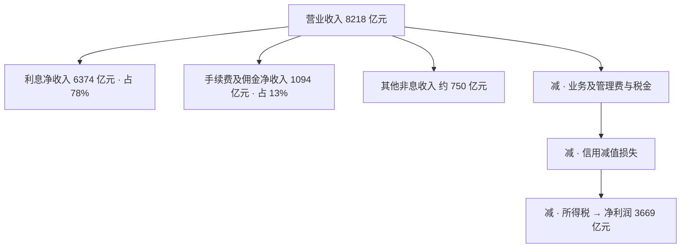

本文以工商银行 2024 年年度报告为样本，从头读一遍银行财报：先看资产负债表，再看利润表，然后是风险指标与口径，最后回到系统，看这些数字如何产生。年报于 2025 年 3 月披露，全文数字均出自公开数据；生词可随读随查[《银行业务术语速查》](/posts/banking-glossary/)。

## 存款为什么记在负债端

先给两张主表定位：资产负债表回答「某一时点，这家机构拥有什么、欠着什么」；利润表回答「一段时期内，赚了多少、花了多少」。前者记录存量，后者记录流量。

打开资产负债表，第一眼反常的地方在负债端：客户存款，34.84 万亿元。存款明明是储户的钱，怎么会是银行的负债？答案在法律关系里：储户将资金存入银行，资金的所有权转移给银行，储户取得的是对银行的债权。直观地说，存款凭证就是银行开出的一张借条，凭它随时（活期）或到期（定期）取回本金和利息。既是欠款，便记入负债端；而贷出的 28.37 万亿元贷款，才是资产。这一差异也决定了读法：制造业公司的资产以厂房、存货与应收账款为主，分析重心是产品；银行的资产以贷款与债券为主，分析重心是两张表的规模与结构。

## 资产负债表：规模与结构

工行 2024 年末总资产 48.82 万亿元，总负债 44.83 万亿元，所有者权益 3.99 万亿元，三者满足会计恒等式「资产 = 负债 + 所有者权益」。用一个家庭的账目作比：一套价值 300 万元的房子，首付 100 万元、房贷 200 万元；房产是资产，房贷是负债，真正属于自己的是 100 万元权益。银行的报表同理，只是科目换成了钱。主要行次如下（单位：万亿元）：

| 行次 | 余额 | 是什么 |
| --- | --- | --- |
| 客户贷款及垫款 | 28.37 | 资产端最大项，信贷业务的账面 |
| 金融投资 | 14.15 | 以债券为主，赚取利息，需要资金时也可较快卖出 |
| 现金、存放央行、同业往来等 | 约 6.30 | 存款准备金、拆借头寸等 |
| 吸收存款（负债） | 34.84 | 欠储户的资金，占总负债的 78% |
| 同业负债、应付债券等（负债） | 约 10.00 | 同业拆借和发债 |
| 所有者权益 | 3.99 | 股东的资金 |

表中两个约数由差额倒算得出，年报中各自另有细分行次，此处仅呈现结构。

权益占比是第一处值得展开的结构特征。3.99 万亿元对应 48.82 万亿元总资产，占比 8%：银行以自有资金支撑 8% 的规模，其余 92% 来自负债。上文的房子是三倍杠杆，银行是十二倍。杠杆高不是某一家银行激进，而是行业形态使然：存贷利差微薄（贷款利率高出存款利率的部分），不借助杠杆便难以形成规模。监管为杠杆设置边界的工具是资本充足率：自有资本须与资产的风险规模保持一定比例，上一篇已详述。

存款与贷款的差额是第二处。存款比贷款多出 6 万多亿元：资金并未全部贷出，一部分按规定存入央行作为存款准备金（监管不允许把存款全部贷出，以备储户集中取现），一部分购入债券，一部分拆借给同业，即银行之间的短期借贷，通常只隔一夜。存款是原料，贷款是产品，银行的日常经营，即是将前者持续转换为后者。

这张表还有一条看不见的边界。代销理财、托管等业务经手的资金不进入资产负债表：资金归投资者所有、独立托管，赚了亏了都由投资者承担，银行只收取手续费，业内称之为「表外」。

## 利润表：钱从哪里来

利润表回答「赚了多少、花了多少」。2024 年，工行实现营业收入 8218 亿元。其中利息净收入 6374 亿元，占 78%；手续费及佣金净收入 1094 亿元，占 13%；其余约 750 亿元来自投资收益等其他非息收入。

*下图为 2024 年工商银行营业收入的构成与去向。利息净收入 6374 亿元占近八成，是最主要的收入来源；信用减值损失是利润表上弹性最大的一项，最终净利润 3669 亿元。*

## 息差：主力生意的毛利

利息净收入是低买高卖资金的差价。假想一家最简单的银行：以 2% 的利率吸收存款，再以 4% 的利率放贷，中间 2 个百分点的差价就是它的毛利。衡量它的指标是净息差（NIM，Net Interest Margin）：净利息收入除以生息资产，即贷款和债券这些持续产息的资产。工行 2024 年净息差为 1.42%，上一年为 1.61%，一年收窄 19 个基点；行业层面，商业银行四季度均值为 1.52%（金融监管总局口径）。

息差收窄是全行业的共同处境，原因来自两端：贷款端，贷款市场报价利率（LPR，Loan Prime Rate）多轮下调，存量房贷利率调整；存款端，储户将活期存款转为定期，付息成本难以下降。分析近两年的银行利润表，净息差是首要项目。

手续费及佣金净收入来自不动用自有资金的业务：支付结算、代销理财基金保险、托管。这部分收入不承担信用风险，监管亦长期鼓励银行提高其占比，不过该项收入 2024 年占比为 13%，转型仍在途中。

## 利润表：钱被什么扣走

自营业收入至净利润，需依次扣除业务及管理费（以人力与运营成本为主）、税金及附加，以及信用减值损失。信用减值损失是拨备的落账科目——拨备，指银行为预计收不回的贷款预先提存的准备金。举一个例子：一笔 100 万元的贷款，测算预计最终收不回 2 万元，银行当下便把这 2 万元计为费用，同时提存等额准备金，哪怕坏账三年后才真正发生。测算方法由会计准则规定，即风险篇介绍的 ECL 模型（预期信用损失，Expected Credit Loss）。拨备多提一分，当期利润便少一分，这是银行利润表上弹性最大的项目。

工行 2024 年净利润 3669 亿元，归属于母公司股东的部分为 3658.63 亿元。以净利润除以全年平均总资产约 46.8 万亿元，得到平均总资产回报率（ROA，Return on Assets）0.78%，与年报披露值一致；对股东口径计算，加权平均权益回报率（ROE，Return on Equity）为 9.88%。0.78% 的回报率低于一般行业，非金融企业的 ROA 达到 5% 已属优秀；换算直观些，工行每 100 元资产，一年赚 7 角 8 分。而银行的盈利模式，正是以薄利乘以巨量规模。

## 拿什么吸收损失

银行财报另有一组指标，与风险直接相关，它们共同回答一个问题：这家银行以什么吸收损失。表中第一个指标涉及不良贷款：监管把贷款按风险分为五级（正常、关注、次级、可疑、损失），后三类合称不良，如同体检从健康到需要治疗。这些指标各管一层：不良与拨备应对预计中的损失，资本应对预计之外的损失——风险篇的三道防线，落在报表上就是这几行。

| 指标 | 工行 2024 | 解读 |
| --- | --- | --- |
| 不良贷款率 | 1.34% | 不良贷款 ÷ 贷款总额，比上年降 0.02 个百分点 |
| 拨备覆盖率 | 214.91% | 每 1 元不良贷款背后有 2.15 元减值准备，监管下限区间为 120%~150% |
| 核心一级资本充足率 | 14.10% | 监管要求 7.5% 起步（最低 5% 加储备资本 2.5%，系统重要性银行再加附加） |
| 资本充足率 | 19.39% | 完整口径：在核心一级资本之外，计入二级资本等补充资本 |

综合来看，工行 2024 年报呈现三重特征：利润微增，息差收窄，资产质量平稳。不良率下降 0.02 个百分点，拨备覆盖率上升 0.94 个百分点，安全垫明显厚于监管要求。利润未见高增长，部分原因是拨备计提较多——为未来可能发生的坏账预先计提准备，当期利润相应减少。

## 数字为什么对不上

读银行新闻时有一个常见困惑：同一家银行、同一个指标，不同文件里的数字偶尔对不上。原因在于，同一件事银行手中不止一本账。同一座城市有交通图、地形图、旅游图之分：底层数据一致，比例尺与图例各不相同。年报按会计准则编制、经审计，面向投资者；监管报表（业内通称 1104 体系）按监管的定义出数，报送国家金融监督管理总局；管理会计口径用于内部考核，例如以内部资金转移定价（FTP，Funds Transfer Pricing）为每笔存贷款核定内部资金成本。三种口径的指标名称可能相同，定义细节各异；数字对不上时，先查证口径，多半是图例不同，而非哪一方算错。

另有两点须知：48.82 万亿元为集团合并数（含工银理财等子公司），工商银行总行单独的数字小于此；工行在上海、香港两地上市（即 A+H），中国企业会计准则（CAS，Chinese Accounting Standards）与国际财务报告准则（IFRS，International Financial Reporting Standards）两套准则并行，数字基本一致。

年报的获取渠道包括巨潮资讯网、沪深交易所披露平台、港交所披露易，以及银行官网的投资者关系栏目。披露按季度滚动，年报最完整，多在次年 3 月发布。应选用「年度报告（全文）」，并核对审计意见页（会计师事务所出具的独立核查结论）；业绩快报并非年报，它只是未经审计的初步数据。

## 数字是怎么产生的

最后一个问题：这些数字是怎么产生的？它们并非财务部门月底临时编制，而是记账系统的下游——分户账记录每笔业务的明细，日终跑批按科目汇总进总账，科目即全局枚举；总账余额表构成资产负债表的原子构件，再经报表平台调整与合并，最终形成对外披露的年报。对开发者而言，由此可预期的需求包括：月初总账冻结，调账需走特殊通道；出报表前全行对账必须清零；监管报送与年报对不上时，需撰写差异说明——多数情况下，差异源自口径。科目体系并非一成不变：新准则上线（如 2018 年切换 IFRS 9）往往伴随科目大改，是全行级的系统项目。

## 收官：把概念放回行次

系列至此收官。六篇的概念各归行次：存款与账户对应吸收存款，信贷对应贷款及垫款与 1.34% 的不良；理财与表外对应手续费收入与表外托管资产，风险资本对应核心一级资本充足率的 14.10%；支付清算则藏在手续费与同业往来的行次之中，第一篇的业务地图即是这两张表本身。

若以一句话概括：银行以借入资金发放贷款、赚取利差，以拨备与资本吸收损失，并每年在财报中如实披露。系列正文至此完结。二维码收单、人民币跨境支付系统（CIPS，Cross-border Interbank Payment System）、信用卡等支线，留待日后另文再述。术语词典将继续按读者反馈增补，未收录的生词欢迎指出。
