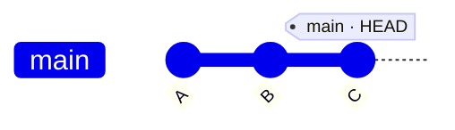
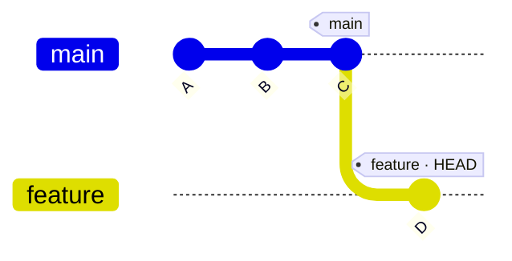
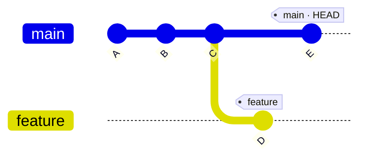
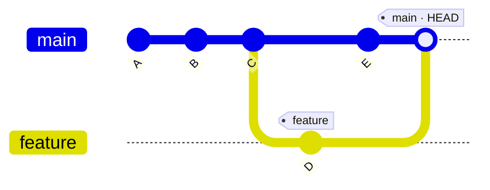

功能写到一半，线上突然报了 bug；改动还没验证，又冒出一个新想法想试试。所有工作都排在 main 一条线上时，它们只能互相搅在一起。**分支**把这些工作隔开，让每件事在自己的时间线上推进——这是 Git 最重要的使用方式，没有之一。

这篇从分支的模型讲起，走完日常全套操作：创建、切换、合并、解决冲突、推到远端协作。

## 分支是什么

提交串成一条链，每个提交记住自己的父提交，历史就是这条链。而**分支只是指向链上某个提交的指针**：创建一个分支，不过是在 `.git/refs/heads/` 下写一个 41 字节的小文件（提交的 SHA-1 加个换行），几乎零成本。Git 鼓励多开分支，根源就在这里。



图里 `main`、`HEAD` 都挂在提交 C 上：main 指向最新提交，HEAD 指向当前所在分支。你在哪个分支，HEAD 就跟着谁。新开一个 `feature` 分支并提交 D：



main 停在原地，feature 前进了一格。切回 main 再提交 E：



两条时间线就此分岔，互不干扰——这就是分支隔离工作的全部原理。

## 基本操作

```bash
git branch            # 列出本地分支，* 标记当前分支
git branch <名字>      # 创建分支（停在当前分支不动）
git switch <名字>      # 切换分支
git switch -c <名字>   # 创建并切换
```

实际跑一遍：

```
$ git branch
* main

$ git switch -c feature/welcome
Switched to a new branch 'feature/welcome'

$ git branch
* feature/welcome
  main
```

老教程里的 `git checkout` 也能干这几件事。Git 2.23 把它拆成了 `switch`（切分支）和 `restore`（恢复文件），语义更清楚，新习惯建议用 `switch`。

## 完整走一遍：一个功能一个分支

从 main 拉出分支，开发、提交（想提交多少次都行），完了合并回 main、删掉分支：

```
$ git switch -c feature/welcome
Switched to a new branch 'feature/welcome'

$ vim welcome.txt                 # 开发、自测
$ git add welcome.txt
$ git commit -m "add welcome page"
[feature/welcome ee826e9] add welcome page
 1 file changed, 1 insertion(+)
 create mode 100644 welcome.txt

$ git switch main
Switched to branch 'main'
$ git merge feature/welcome
Updating 2d0293e..ee826e9
Fast-forward
 welcome.txt | 1 +
 1 file changed, 1 insertion(+)
 create mode 100644 welcome.txt

$ git branch -d feature/welcome
Deleted branch feature/welcome (was ee826e9).
```

看一眼历史：

```
$ git log --oneline --graph --all
* ee826e9 add welcome page
* 2d0293e add README
* 8c99240 init
```

`-d` 是安全删除：分支上的提交还没合并进别处时会拒绝你；确定不要了再用 `-D` 强删。日常用 `--oneline --graph --all` 看历史，分支的分与合一目了然。

## 合并的两种结果

上面的合并输出写着 **Fast-forward**：main 在分岔后没有新提交，合并只是把 main 的指针往前挪到 feature 的位置，不产生新提交。图上看就是箭头直接前移。

如果两边都有新提交（main 上改了 README，feature 上加了 build_date.txt），Git 会做**三方合并**：找出共同祖先，把两条线合在一起，生成一个有**两个父提交**的合并提交：



```
$ git merge feature/date
Merge made by the 'ort' strategy.
 build_date.txt | 1 +
 1 file changed, 1 insertion(+)
 create mode 100644 build_date.txt

$ git log --oneline --graph --all
*   f7e40aa Merge branch 'feature/date'
|\
| * ba82abf record build date
* | 5492d46 update README
|/
* ee826e9 add welcome page
* 2d0293e add README
* 8c99240 init
```

想让每次合并都保留"这里存在过一个功能分支"的痕迹，加 `--no-ff` 强制生成合并提交。个人项目随意，团队里常见约定之一。

## 合并冲突：不可怕

同一文件的同一段，两边都改了，Git 不知道听谁的，就把决定权交给你：

```
$ git merge feature/greet
Auto-merging greeting.txt
CONFLICT (content): Merge conflict in greeting.txt
Automatic merge failed; fix conflicts and then commit the result.
```

`git status` 会列出冲突文件：

```
Unmerged paths:
  (use "git add <file>..." to mark resolution)
	both modified:   greeting.txt
```

打开文件，Git 用标记把两个版本都摆出来：

```
<<<<<<< HEAD
Hello, main!
=======
Hello, feature!
>>>>>>> feature/greet
```

`<<<<<<<` 到 `=======` 是当前分支（HEAD）的内容，`=======` 到 `>>>>>>>` 是要合进来的分支的内容。处理方式很朴素：改成最终想要的样子（保留一边、或融合两边），把标记删干净，然后：

```
$ echo "Hello, world!" > greeting.txt   # 改成最终内容
$ git add greeting.txt                  # 声明"这个文件我处理完了"
$ git commit                            # Git 已备好默认信息 Merge branch 'feature/greet'
```

其余没有冲突的文件 Git 已经自动合并好，不用管。VS Code 等图形工具会在标记上方放"保留哪边"的按钮，点起来方便，原理和手改一样。

打不下去了想跑？`git merge --abort` 一步回到合并之前，工作区恢复原样。冲突只关乎"这一刻怎么改"，随时可以重头再来。

## 推到远端，走 Pull Request

单人仓库直接提交 main 也无妨（本博客就是这么发的）；多人协作或重要功能，推荐把分支推上去，走 Pull Request（PR）让别人评审后再合并：

```
$ git push -u origin feature/welcome
```

`-u` 是 `--set-upstream` 的缩写，把本地分支和远端的 `origin/feature/welcome` 关联起来，之后在这个分支上裸敲 `git push`、`git pull` 就行。接着在 GitHub 页面点 "Compare & pull request"，写清楚改了什么、为什么，评审通过点 merge，最后清理远端分支：

```
$ git push origin --delete feature/welcome
```

本地同步一下，删掉已合并的本地分支：

```
$ git switch main
$ git pull
$ git branch -d feature/welcome
```

## 几条团队约定

分支管理一半靠命令，一半靠约定。几条简单够用的：

- **main 保持随时可用**：没做完的工作不进 main，哪怕项目里只有你一个人——好处是任何时刻都能从 main 发版或回退。
- **分支短命**：一个分支只装一件事，尽量几天内合并掉。活几周的分支，合并时的冲突痛苦加倍；大功能拆成小步，一步一个分支。
- **命名带上用途**：`feature/login-page`、`fix/null-crash`、`hotfix/0.3.1`，扫一眼就知道这分支是干什么的。
- **合并前先同步**：开分支前 `git switch main && git pull`，合并前再同步一次 main，能省掉一大半无谓的冲突。

## 常用命令

```bash
git branch                       # 列出分支
git branch <名字>                 # 创建分支
git switch <名字>                 # 切换分支
git switch -c <名字>              # 创建并切换
git merge <分支>                  # 把指定分支合并进来
git merge --abort                # 放弃当前合并，回到合并前
git branch -d <名字>              # 删除分支（未合并会拒绝）
git branch -D <名字>              # 强制删除
git log --oneline --graph --all  # 图形化查看所有分支的历史
git push -u origin <分支>         # 首次推送并关联远端分支
git push origin --delete <分支>   # 删除远端分支
```

## 写在最后

到这里，分支的日常已经完整：开分支隔离工作，合并收回来，冲突了手工裁决，远端协作走 PR。模型上只需记住一句话——**分支只是指向某个提交的指针**。理解了这一点，"分支怎么莫名其妙没了""切分支时文件怎么变了"这类疑惑都能自己推理出来。

进阶可以再了解 `git stash`（切分支前暂存没写完的改动）、`git rebase`（把提交挪到新的基底上，历史更线性）、`git cherry-pick`（摘单个提交）和 `git tag`（给发布打标记）。
