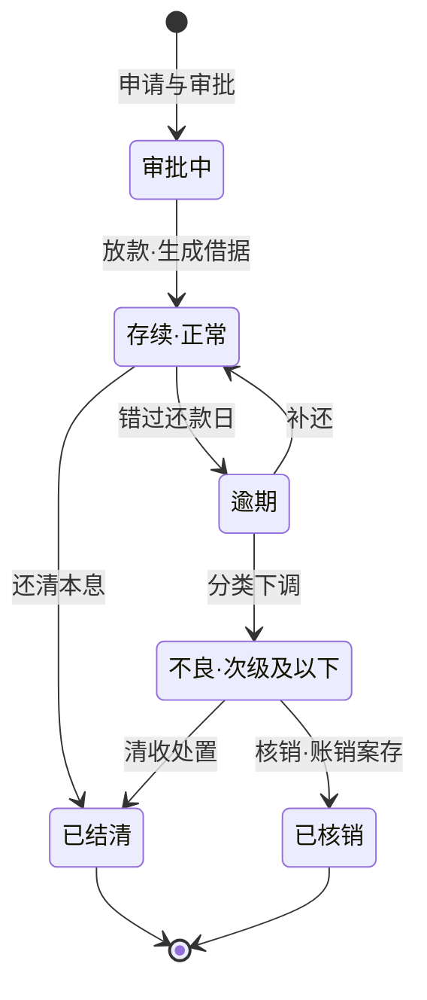
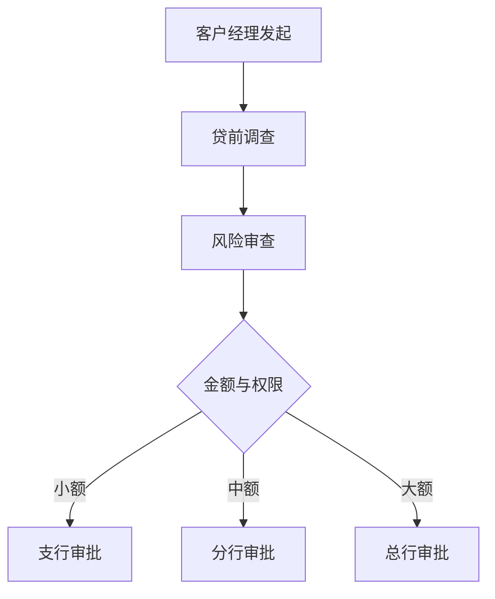

《银行业务入门》里说，资产业务是银行的利润发动机，贷款是大头；《银行业务术语速查》里，信贷词汇单独成组。这篇把两者接起来：把一笔贷款从生到死走一遍。信贷系统的需求文档是银行科技里公认最厚的一类，但抓住「贷款是一张带生命周期状态机的表」这个锚点，再厚的文档都有处挂靠。

生词随读随查配套的[《银行业务术语速查》](/posts/banking-glossary/)。

## 一笔贷款的一生

先上主图——借据的生命周期：

两个说明：

1. 图做了简化。真实系统里，**逾期**（还款行为维度）和**五级分类**（风险评价维度）是两个独立字段——逾期不必然下调分类，分类调整也不只看逾期。图里排成一条线，纯粹为了好读。
2. 借据通常按「每次提款」生成：批了 1000 万授信、分三笔提用，就是三张借据。循环额度（随借随还）让状态机更绕，但骨架不变。

开发者的读法：贷款系统的主表就是这张状态机的物化——每行借据带状态、余额、利率、还款计划，其余模块都围着它读写。

## 贷前：授信、审批、担保

**授信**是「先批额度」，**用信**是「真的提款」，两回事：批了 1000 万授信的企业可能一分钱没用。授信一般一年一期，到期重检。

产品谱系按客户分两排：零售排是房贷、消费贷、经营贷——金额小、高度标准化、靠跑量；对公排是流动资金贷款、项目贷款、贸易融资——金额大、一户一策、重定制。第一篇讲的零售/对公系统形态差异，根源就是产品形态。

审批走分级授权的链条：

金额越大、风险越高，审批权限越往上收，谁审批谁负责。配套「三查」制度：**贷前调查**看客户与用途，**贷时审查**在审批环节核实，**贷后检查**盯资金去向与经营变化——三查贯穿贷款一生，不是放完就完。

担保是风控的第二道防线，四件套按常见程度排：**信用**（纯凭还款能力与意愿，给优质客户）、**保证**（第三方担保人兜底）、**抵押**（房产等不转移占有）、**质押**（存单、理财等转移占有）。要紧的观念：第一还款来源永远是经营现金流，担保只是第二还款来源——「有抵押就敢放」在行业里是被点名批评的坏习惯。

定价方面，贷款利率 = LPR 加点。LPR（贷款市场报价利率）由 18 家报价行在 MLF 利率基础上加点报价，每月 20 日公布，分 1 年期和 5 年期以上两档，房贷锚定后者。你的贷款比 LPR 高几个点，就是银行对这笔业务风险与资金成本的综合定价——风险越高，加点越高。

## 贷中：放款

审批通过只是拿到额度，放款才是钱出门。系统视角三件事：

1. **额度管控**：每笔放款占用授信额度，还款时释放。额度校验是放款链路里最密集的判断：可用不足、被冻结、有效期过期，任何一条不过都放不出去。
2. **借据生成**：一比一锁定利率、期限、还款计划。
3. **受托支付**：超过监管门槛的贷款资金，不放给借款人，而是直接付给借款人的交易对手，防挪用。2024 年 7 月施行的贷款「三个办法」给了三档门槛：个人消费贷单次提款超 30 万、个人经营贷超 50 万、固定资产贷款向单一对象付款超 1000 万，都应受托支付。

受托支付是信贷与支付两条线的交汇点：它本质是一笔带用途约束的定向转账指令。做支付的人在这里撞见信贷，做信贷的人在这里撞见支付。

## 贷后：计息、还款、分类、处置

钱放出去，系统最重的活才开始：

- **计息与结息**：按日计息、按月或按季结息，全靠日终跑批。计提应收利息是每天雷打不动的批量作业。
- **还款方式**：等额本息（月供固定，前期利息占比高，房贷主流）、等额本金（月供递减，总利息更少）、先息后本（对公常见，到期一次性还本，续贷压力集中）。还款计划在放款时一次生成，系统按表扣款。
- **五级分类**：不是放款时定一次就完，而是动态重检。2023 年 7 月施行的《商业银行金融资产风险分类办法》把标准定得很硬：逾期至少归关注类，逾期超 90 天至少次级、超 270 天至少可疑、超 360 天归损失；并且以债务人为中心——同一债务人在本行债权超一成不良，名下全部债权都要下调。分类每沉一档，**拨备**计提加重一档，直接打薄当期利润。
- **不良处置**：催收 → 重组（展期、降息，救得活的救）→ 清收处置（变现担保物）→ **核销**。核销不是免债：账面销掉、债权保留（账销案存），日后追回的钱照常入账。

## 开发者视角

信贷域的系统家族大致五类：**授信与额度管理**（额度是共享资源，多系统读写）、**审批工作流**（多级审批、意见留痕）、**放款与借据管理**（状态机主战场）、**贷后管理**（分类重检、风险预警）、**催收系统**（分案、跟进、还款协商）。

两个容易低估的点：

1. **批处理极重**。计提、结息、罚息、分类重检、额度释放全在日终跑批里。跑批出错比联机出错难发现——白天看不出异常，月底对账炸雷。
2. **与核心系统的边界**。放款入账、利息入账、核销，账务都落核心的贷款科目；信贷系统管业务状态，账在核心——又一次印证「一切系统尽头是核心」。

## 小结与下一站

一笔贷款 = 状态机（借据生命周期）+ 计划表（还款计划）+ 额度账本（授信管控），三件套撑起整个信贷域。系列下一篇写**存款与账户**——Ⅰ Ⅱ Ⅲ 类账户、计息规则，回到负债端。
