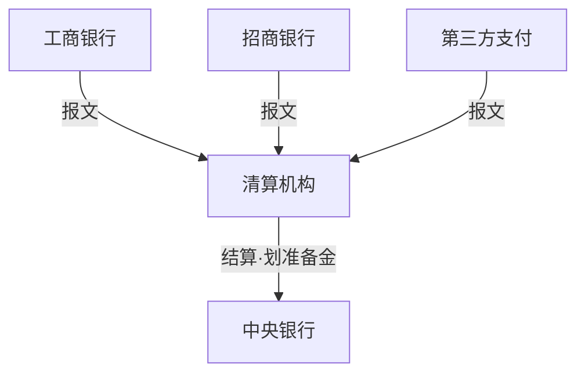
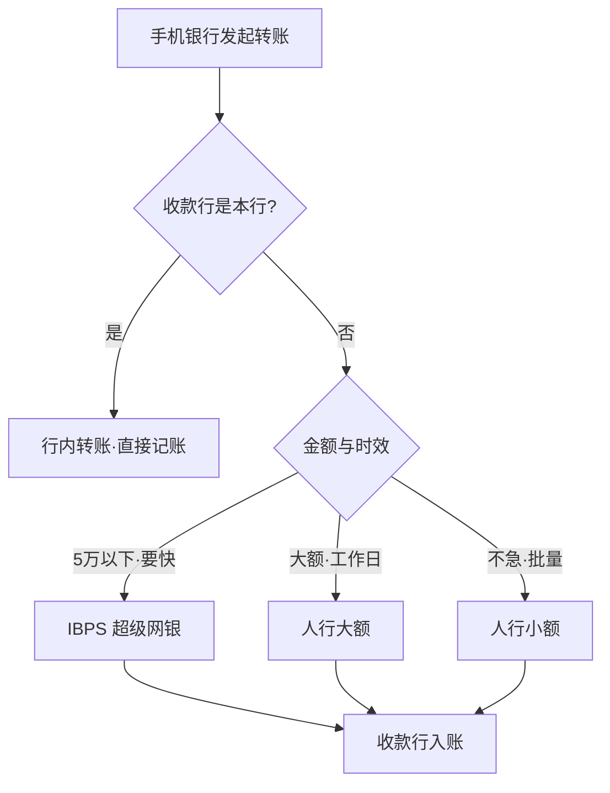

上一篇《银行业务入门》里，那笔 500 块的跨行转账走到「清算网络」就断了镜头。这篇把它展开：钱在清算网络里怎么走、人行大小额和网联银联各管哪一段、清算和结算到底差在哪。做支付、渠道、对账相关的银行科技工作，这张网就是你的全部业务背景。生词随读随查配套的[《银行业务术语速查》](/posts/banking-glossary/)。

## 先分清三个词：支付、清算、结算

行业黑话里最容易混的三个词，用同一个例子贯穿：工行的客户，给招行的客户转 500 块。

- **支付（payment）**：把 500 块从 A 搬到 B 的全过程，信息流和资金流的统称。
- **清算（clearing）**：算账。工行和招行之间一天有几百万笔互相收付，逐笔真金白银地划毫无必要——把一段时间内的收付指令集中起来两两对抵，算出「工行该净付招行多少」，这一步叫清算，是**信息层**的活。对抵的过程叫**轧差**。
- **结算（settlement）**：真正划钱。按清算结果把净差额划过去。每家银行都在央行开有准备金账户，跨行结算最终发生在**央行的账本**上，这是**资金层**的活。

记住一句话：**清算管算账，结算管划钱**。「清算文件」「清算日」「结算账户」这些满文档都是的词，全部能挂回这个区分上。

## 清算网络：把 N×N 变成星型

中国有几千家银行类机构，外加几百张支付牌照。如果任意两家直连，连接数是平方级灾难；实际的架构是所有机构都只连到少数几家**清算机构**，由它们做中间人：

注意这张图里信息与资金的分工：报文（信息）进清算机构，资金（结算）最终走央行。清算机构只转接指令、算账，自己的账本不动客户的钱——这就是为什么清算机构是金融基础设施，牌照管得极严。

国内主要通道的分工：

| 通道 | 运营方 | 模式 | 典型场景 |
| --- | --- | --- | --- |
| 大额支付系统 HVPS | 人行 | 实时全额·逐笔结算 | 大额对公转账、银行间资金往来，单笔不限金额 |
| 小额支付系统 BEPS | 人行 | 7×24 批量轧差 | 代发工资、公共缴费这类不急的钱，单笔上限 100 万 |
| 网上支付跨行清算系统 IBPS（超级网银） | 人行 | 7×24 实时转发 | 手机银行跨行转账秒到，常见单笔 5 万以下实时 |
| 银联 CUPS | 银联 | 银行卡跨行转接 | 刷卡、ATM 跨行取现、扫码收单 |
| 网联 NUCC | 网联 | 线上支付转接 | 支付宝、微信绑银行卡的交易 |

几条通道分开说：

- **大额支付系统**（HVPS，High-Value Payment System）是银行间的主动脉：法定工作日运行（前一晚开班、当天傍晚日终，具体时刻人行会调整），周末和法定节假日休市。它不轧差，逐笔实时划资金（术语叫 RTGS，Real-Time Gross Settlement，实时全额结算），因为走这条道的钱金额大、时效敏感。
- **小额支付系统**（BEPS，Bulk Electronic Payment System）走另一个极端：7×24 不停，每天 16:00 日切，指令攒起来批量轧差，资金在清算日集中划。便宜，适合不急的钱。
- **IBPS**（Internet Banking Payment System，俗称超级网银）是小额的「快版」：指令实时转发，7×24，手机银行跨行转账「秒到」的幕后功臣。常见规则是 5 万以下实时到账，超过 5 万只能走大额——所以周末跨行转一笔大钱会失败。很多支付系统新人的第一个线上 bug 就死在这条规则上。
- **银联**资格最老（2002 年），管银行卡的跨行转接（系统名 CUPS，China UnionPay Switch）：刷卡、ATM 跨行取现、线下扫码收单。
- **网联**（NUCC，NetsUnion Clearing Corporation）最年轻（2017 年）。在它之前，支付宝和微信「直连银行」——在每家银行开一堆备付金账户绕开清算机构划钱，监管看不到完整链路，备付金挪用风险积聚。2018 年 6 月 30 日「断直连」之后，第三方支付涉银行账户的业务一律经网联（或银联）转接。你在银行侧看到的支付宝交易报文，来源就是网联。

## 一笔转账的完整旅程

把上一篇的全景图往里钻一层，核心是通道怎么选：

这段 if-else 叫**支付路由**，是支付系统最核心的逻辑之一。生产环境的路由还要叠加通道可用性、费率、限额、故障降级，但骨架就是这张图。

跟着 500 块走一遍全程：

1. 手机银行（渠道）受理请求，验身份、过风控。
2. 工行核心记账：付款账户扣 500，挂到清算过渡科目，同时接口平台向 IBPS 发出报文。
3. IBPS 实时把报文转发给招行。
4. 招行核心给收款人入账——这时客户已经「秒到」了。
5. 银行之间的钱反而不用急：到清算时点，双方在央行的准备金账户里轧差结算。

注意第 4 步和第 5 步的分离：收款行先凭指令入账，银行间的资金后补——这正是支付系统里大量「在途资金」「垫付」概念的来源，也是对账存在的原因。

## 开发者视角：这些概念长在哪些系统里

- **接口平台/支付前置**：银行对接人行大小额、IBPS、网联、银联的统一网关，管报文收发、加签验签、重发补发。银行科技里说「做支付」，多数时候是做这个。
- **支付路由**：上一节那张决策图的生产级版本，通常做成可配置的规则引擎。
- **对账系统**：链路上每一环都可能掉单——渠道显示成功、核心记账失败；报文发出去了、回执丢了；两边日切不在同一秒。对账就是把己方流水和对手方（人行、网联、银联、对手行）的清算文件逐笔核对，差账分**长款**（多收了）和**短款**（少收了）人工处理。这是银行和支付公司最典型的新人练手系统：业务闭环完整、SQL 用量巨大、出错代价高但又不会当场爆炸。
- **日切**：系统「营业日」的切换时点，各系统不一样——小额 16:00、大额 17:30。所以「一天」在不同系统里起止不同，对账文件、报表、计息全挂在各自的工作日上。跨系统对时间，是支付开发著名的雷区。

## 小结与系列下一站

一句总结：支付是全程，清算管算账，结算管划钱；通道按「金额 × 时效」选；指令跑得比钱快，所以需要对账。

系列下一篇写**信贷业务**——从授信到放款到不良，银行真正的利润发动机。二维码标准、电子钱包账户体系、跨境支付（CIPS，Cross-border Interbank Payment System，人民币跨境支付系统）是三条可选支线，有机会单独展开。
