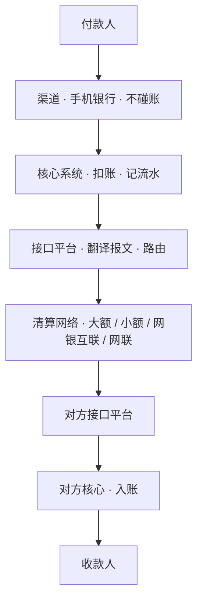

《核心系统入门》看的是账本，本篇看钱走的路。前番外把镜头推进了核心，本篇补上三兄弟的另一位：支付系统。《支付与清算入门》讲过钱在机构之间流动的业务规则（清算与结算、大小额分工）；本篇讲承载这些规则的系统本身：一笔转账的指令如何生成、走哪条路、路上遇到问题怎么办。生词随读随查[《银行业务术语速查》](/posts/banking-glossary/)。

## 一笔转账报文出门

《核心系统入门》跟着一笔存款走进核心看记账；本篇跟着一笔转账出门。你在手机银行给外地的朋友转 5,000 元：手机银行是渠道，受理后不碰账；核心系统扣减你的账户，记一笔流水；接下来的事，就轮到支付系统了。

行内的支付系统（很多银行叫接口平台或支付前置）是核心与外部世界之间的翻译官：它把核心的记账结果翻译成报文，按金额与时效选择清算路，发出，等待回执。报文到达对方银行的接口平台，翻译回对方的语言，驱动对方核心入账。你在 App 里看到「转账成功」时，是一段报文走完了这条双向的路。

图 1　一笔转账的全链路（示意）

## 指令的一生

支付系统管理的核心对象是指令（一笔待执行的付款），生命周期是一个状态机：受理、发报、成功、失败、超时。多数指令走到成功或失败就结束了，真正考验系统的是第三种结局：超时，报文发出去，回执没回来。

超时的指令处于「不知道成没成功」的状态，《对账》篇说的单边风险正源于此。系统的处理次序是：先查询查复，向清算网络询问这笔指令的最终状态；查明确的按成功或失败处理；查不明的先行挂账，交由次日对账收口。重发则必须幂等：同一笔指令重发多次，对方只能入账一次，靠的是全局唯一的流水号。对账篇说「编号体系是对账的前提」，它的用武之地就在这里。

## 清算网络怎么分工

出了行，报文走上清算网络。各条路各有分工，沿用《支付与清算入门》口径列表如下：

| 通道 | 特点 | 适合谁 |
| --- | --- | --- |
| 大额支付系统（HVPS） | 实时全额清算（RTGS），单笔金额不限，工作日运行 | 对公大额、同业 |
| 小额支付系统（BEPS） | 批量、轧差净额，7×24 小时，单笔金额有上限 | 个人日常、缴费 |
| 网银互联（IBPS，俗称超级网银） | 实时，7×24 小时 | 个人实时转账 |
| 网联（NUCC） | 第三方支付机构与银行之间的条码与快捷支付 | 扫码、电商 |
| 银联（CUPS） | 银行卡跨行交易 | 刷卡、取现 |

支付系统的第一项工作就是路由：按金额、时效、渠道把指令分到合适的通道。一笔 5 万元以下的个人转账走网银互联实时到账；一笔上亿的同业拆借必须走大额，逐笔实时全额清算。金额不同，走的路完全不同。

## 报文：系统之间的书信

报文是系统之间传递支付指令的标准化书信。书写规则有两种通行的格式。

银行卡世界的经典格式是 ISO 8583：位图加定长字段的结构紧凑，几十年来的刷卡交易都走它。支付系统世界的现代格式是 ISO 20022：国际标准化组织发布、采用 XML 编码，中国人民银行第二代支付系统即采用这一标准与 SWIFT 等国际系统互通。两种格式并存带来了翻译工作：网联一侧连接报文格式千差万别的各家银行，另一侧连接支付机构，报文转换由网联统一完成。

无论哪种格式，报文的核心要素是同一组：交易类型、金额、账号、流水号、日期。其中流水号值得单独强调：它是全链路的身份标识，查询查复凭它、重发幂等凭它、对账勾对也凭它。一句老话在这里再次应验：编号体系是对账的前提。

## 日切与清算文件

《核心系统入门》讲过日切：银行的「一天」不由零点划分。清算网络各有自己的日切时刻（人民银行支付系统在下午到傍晚之间先后日切，具体时刻随监管调整而变化），日切之后发生的交易记入下一个营业日。跨系统对数据时，两端可能不在同一个「一天」里，这是对账要对出时间差的根源。

日切之后，清算机构完成轧差与清算，生成对账文件与清算文件下发；次日凌晨起，银行的对账任务（对账篇的归并勾对）与资金清算依次展开。头寸，即本行存放在清算网络中的备用资金，随清算结果每日增减。支付系统盯的是头寸，动的是它而不是客户账户。

## 渠道、支付、核心

至此三兄弟凑齐了。渠道是入口：柜面、手机银行、网银，只管交互，不碰账。支付系统是路：接口平台翻译报文、路由指令、管理状态机与重发，动的是清算头寸，也不碰客户账。核心是账本：所有账务的最终归属。一笔转账穿越三者，账实分离、路账分离。「渠道不碰账」的老规矩，支付系统同样遵守。

番外至此两篇：账本（核心）与路（支付）。第三位兄弟渠道的系统细节，连同二维码收单、信用卡，留待日后提笔。词典继续按读者反馈增补，读到生词欢迎指出。
