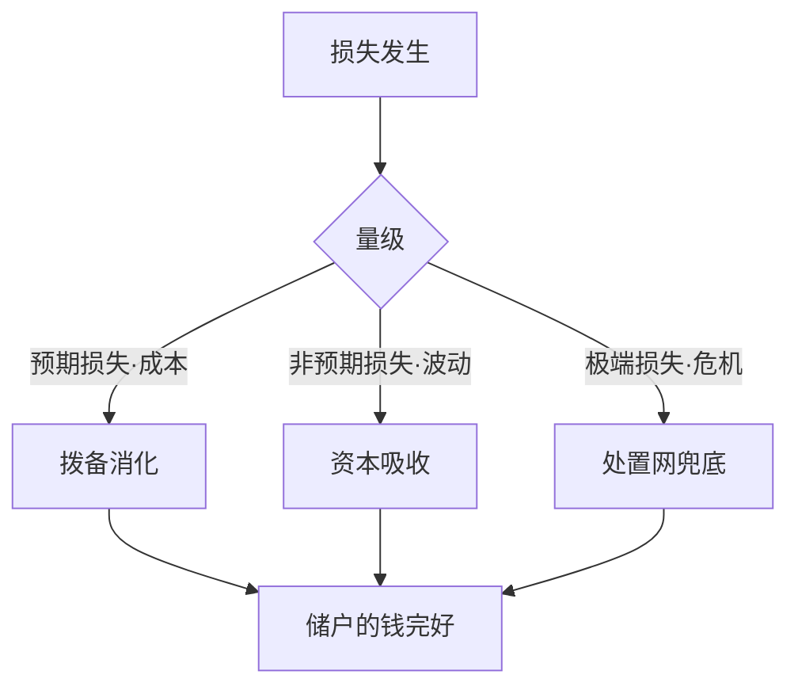
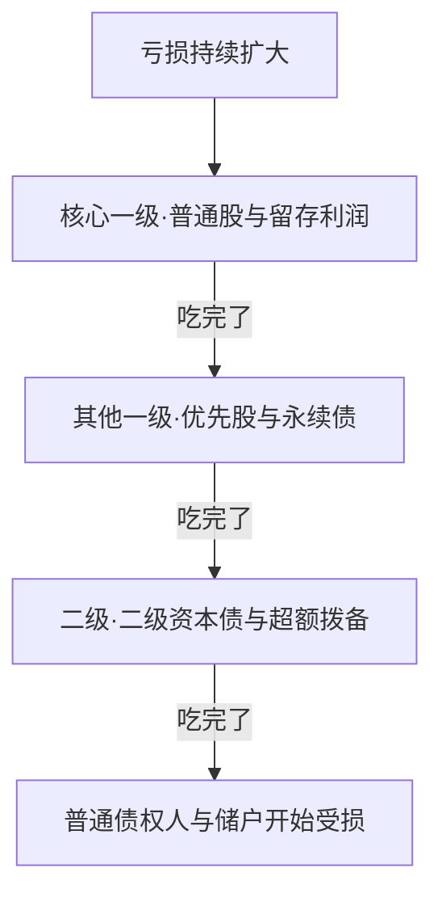

系列前五篇讲的都是钱怎么流动：业务地图、支付清算、信贷、存款账户、理财表外。但开篇那句「银行是经营风险的金融中介」里，风险这个主角一直没正式登场——它只在各篇里露过脸：信贷篇为坏账计提的**拨备**，存款篇兜底的**存款保险**，理财篇 2022 年底的赎回潮。这篇把暗线扶正：损失真的发生时，银行靠什么扛？监管怎么把「扛得住」量化成几个数字？读完这篇，第一篇埋的「资本稀缺」伏笔也就闭环了。

生词随读随查配套的[《银行业务术语速查》](/posts/banking-glossary/)。

## 损失分三档，各有各的接盘手

把银行可能遭到的损失按量级分三档，兜底机制完全不同：

- **预期损失**：日常经营里「平均每年总会坏掉那么多」的部分。拉长到三五年看，不良率大体稳定，这部分损失是成本，不是意外。精算口径：预期损失 = PD × LGD × EAD——违约概率（PD，Probability of Default）、违约损失率（LGD，Loss Given Default）、违约风险暴露（EAD，Exposure at Default），三个参数是信贷风控模型的核心变量。
- **非预期损失**：比平均值糟糕的部分。某年不良率突然翻倍、行情反转债券亏钱——波动不是成本，是要另有人接住的东西。
- **极端损失**：百年一遇的系统性危机。指望任何一家银行自己扛住不现实，靠的是处置网：存款保险、央行最后贷款人、监管接管重组。



这张图是整篇的骨架：三档损失，三道防线。往下两节，分别把拨备和资本讲透。

## 拨备：给预期损失记账

拨备（贷款损失准备）是预先计提进利润表的坏账钱——钱没有真实划走，但利润已经按规则扣掉（「计提」这个词，词典里有）。信贷篇说过分类越沉、计提越重；现在补上监管怎么定底线。两个比率：

- **拨备覆盖率** = 贷款损失准备 ÷ 不良贷款余额：对已经认出来的不良，准备金盖了多厚。
- **贷款拨备率** = 贷款损失准备 ÷ 各项贷款余额：不挑分类结果，全部贷款整体垫了多厚。

监管要求按银行分类准确性、处置主动性等动态调整（2011 年定基本标准，2018 年起改为区间）：拨备覆盖率 120%~150%，贷款拨备率 1.5%~2.5%。而行业实际远比监管线厚——2025 年一季度末上市银行平均拨备覆盖率约 238%。厚出来的部分是利润的蓄水池：多提拨备压当期利润，少提放利润，丰年存粮、荒年吃粮。读银行财报时，拨备覆盖率是判断「利润有没有藏粮」的第一指标。

## 资本：先被亏掉的钱

资本最容易误解的地方：它不是「银行有多少钱」，而是**排在储户前面、先被亏掉的钱**。银行资不抵债时，损失按顺位传播：普通股最先亏光，然后是各类资本工具（多数带减记或转股条款——危机时把债直接划掉或换成股权），再到一般债权人；个人储蓄存款在中国法下还有优先偿付地位，外加存款保险单独兜 50 万。正因为有人排在自己前面受损失，储户才有安全感——资本的本质功能是缓冲垫。

监管把资本分三层，硬度和用途不同：

| 层级 | 构成 | 特点 |
| --- | --- | --- |
| 核心一级资本 | 普通股股本、资本公积、盈余公积、未分配利润 | 最硬，吸损第一顺位 |
| 其他一级资本 | 优先股、永续债（无固定期限资本债券） | 吸损顺位靠后一档，通常带减记或转股条款 |
| 二级资本 | 二级资本债、超额计提的损失准备 | 吸损顺位再靠后一档 |

吸损顺序画成瀑布就是：



## 资本充足率：给缓冲垫定刻度

分母不是总资产，而是**风险加权资产**（RWA，Risk-Weighted Assets）：每笔资产按风险大小乘一个权重再求和——不是所有资产都一样吃资本。2024 年 1 月施行的新《商业银行资本管理办法》里，权重法下的常见值：

| 债权 | 风险权重 | 一句话 |
| --- | --- | --- |
| 国债、央行债权 | 0% | 主权信用，不占资本 |
| 地方政府一般债 / 专项债 | 10% / 20% | 准主权信用 |
| 住房按揭（按 LTV 分档） | 20%~70% | 首付比例越高权重越低 |
| 信用卡循环（合格交易者） | 45% | 还款记录良好的优惠档 |
| 个人消费贷、小微贷款 | 75% | 零售小额分散 |
| 投资级公司 / 中小企业 | 75% / 85% | 新规优惠档 |
| 一般企业 | 100% | 经典基准 |

资金一离开表（担保、代销、托管）就几乎不吃权重——第一篇说的表外逻辑，刻度就在这张表上。

**资本充足率** = 资本净额 ÷ 风险加权资产。监管数字（新办法）：核心一级 5%、一级 6%、总资本 8%；之上再加**储备资本** 2.5%（必须用核心一级满足）、**逆周期资本** 0~2.5%（景气过热时启用）、系统重要性附加 0.25%~1.5%。所以一家普通银行的日常及格线是 8% + 2.5% = 10.5%，系统重要性银行更高。8% 的另一面是杠杆：1 块钱资本能撬 12.5 块风险加权资产——银行天生高杠杆，资本就是给杠杆上的枷锁。

拿一家迷你银行算一遍。总资产一千亿、资本净额六十亿，看资产结构怎么左右资本充足率：

```python
risk_weights: dict[str, float] = {
    "国债": 0.0,
    "住房按揭": 0.30,
    "信用卡贷款": 0.75,
    "一般对公贷款": 1.0,
}

capital: float = 60.0  # 资本净额（亿元）


def risk_weighted_assets(book: dict[str, float]) -> float:
    return sum(amount * risk_weights[name] for name, amount in book.items())


def capital_adequacy_ratio(book: dict[str, float]) -> float:
    return capital / risk_weighted_assets(book)


today: dict[str, float] = {
    "国债": 200.0,
    "住房按揭": 300.0,
    "信用卡贷款": 100.0,
    "一般对公贷款": 400.0,
}

grown: dict[str, float] = {**today, "国债": 100.0, "一般对公贷款": 500.0}

for label, book in [("今天", today), ("调结构后", grown)]:
    print(
        f"{label}：RWA = {risk_weighted_assets(book):.0f} 亿，"
        f"资本充足率 = {capital_adequacy_ratio(book):.1%}"
    )
```

输出：

```text
今天：RWA = 565 亿，资本充足率 = 10.6%
调结构后：RWA = 665 亿，资本充足率 = 9.0%
```

总资产还是一千亿、资本还是六十亿，只把一百亿国债换成了对公贷款，资本充足率就从 10.6% 掉到 9.0%——虽然还在 8% 上方，但已跌破 10.5% 的日常及格线。此刻银行只剩三个动作：补资本（发永续债、二级资本债，或少分红多留利润）、调结构（多持低权重资产）、缩表（少放贷款）。第一篇说的「资本稀缺」，稀缺的就是这个：每放一笔高权重贷款，都在消耗这个有限的数字。

## 巴塞尔协议：三版补丁的逻辑

安全垫的标准是全球银行共同的游戏规则，出自巴塞尔银行监管委员会。三版协议各补一个时代的漏洞：

- **巴塞尔 I**（1988）：第一次全球统一资本充足率 8%，只管信用风险——跨国银行利用各国监管差异套利，先统一刻度。
- **巴塞尔 II**（2004）：三大支柱——最低资本要求（把市场风险、操作风险也纳入计量）、监督检查、市场纪律（信息披露）。允许银行用内部模型算风险，更精细，也埋了新雷。
- **巴塞尔 III**（2010）：2008 年金融危机的直接产物——雷曼倒下暴露出资本质量不行、流动性枯竭。于是提高资本质量（核心一级才是硬通货）、增设储备与逆周期缓冲、加杠杆率红线、新增 LCR 和 NSFR 两个流动性指标、给系统重要性银行上附加资本。

中国的现行版本就是上面引用的新《商业银行资本管理办法》，对标巴塞尔 III 最终方案，并把银行按规模与业务复杂度分三档差异化监管。

**系统重要性与 TLAC**：被认定的我国系统重要性银行（D-SIB，Domestic Systemically Important Bank）2024 年度名单 20 家（2025 年增至 21 家），按系统重要性得分分五组，附加资本 0.25%~1.5%；全球系统重要性银行（G-SIB）还要满足**总损失吸收能力**（TLAC，Total Loss-Absorbing Capacity）——工农中建交五家，外部 TLAC 风险加权比率 2025 年起不低于 16%、2028 年起不低于 18%，2024 年起大行密集发行的 TLAC 非资本债券就是冲这个来的。

**流动性的另一道闸**：资本管「亏得起的底线」，流动性管「钱转得动的底线」——挤兑时银行缺的不是资产，是现金。2018 年施行的《商业银行流动性风险管理办法》立了五个指标：

| 指标 | 适用范围 | 监管要求 |
| --- | --- | --- |
| 流动性覆盖率（LCR，Liquidity Coverage Ratio） | 资产 2000 亿以上 | ≥ 100% |
| 净稳定资金比例（NSFR，Net Stable Funding Ratio） | 资产 2000 亿以上 | ≥ 100% |
| 流动性比例 | 所有银行 | ≥ 25% |
| 流动性匹配率 | 所有银行 | ≥ 100% |
| 优质流动性资产充足率 | 资产 2000 亿以下 | ≥ 100% |

LCR 问「30 天压力情景下够不够活」，NSFR 问「长期资金结构稳不稳」——一个管短期活命，一个管长期体质。理财篇的 2022 年底赎回潮，就是流动性风险在表外的镜像。

## 开发者视角

风险落到系统上，是四个高含金量的模块：

1. **ECL 计提引擎**：新金融工具准则（IFRS 9，国内对应 CAS 22，A+H 上市银行 2018 年起施行）把减值从「五级分类定档、按档计提」升级成**预期信用损失**（ECL，Expected Credit Loss）模型——按信用风险是否显著增加分三阶段，第一阶段计提未来 12 个月预期损失，第二、三阶段计提全生命周期预期损失。PD/LGD/EAD 参数模型加上分阶段状态机，是银行系统里数据科学含量最高的模块。
2. **RWA 计量引擎**：每笔业务打上权重、逐产品逐条线汇总到法人与集团口径，夜间跑批输出资本充足率。表结构不难，难在口径——哪些算风险暴露、权重落哪一档，全是把监管条文翻译成代码的活。
3. **限额与预警**：大额风险暴露、集中度限额在系统里是硬校验，超限放不出款；贷后预警盯着客户经营数据自动触发分类重检——信贷篇的贷后管理，底层就是这套。
4. **监管报送**：1104 报表体系按月、季、年向监管报送全量口径，数据质量是监管检查与处罚的重灾区。做数据仓库的同学，一半需求可能都从这里来。

## 小结与下一站

三道防线 = 拨备（预期损失，利润表消化）+ 资本（非预期损失，股东的钱吸收）+ 处置网（极端损失，存款保险与央行兜底）。监管把三层全部量化成刻度：拨备覆盖率、资本充足率、LCR 与 NSFR——银行经营的每一寸，都在数字上跑。

第一篇的伏笔到这里闭环：**资本是稀缺品**，所以银行爱做不占资本的中间业务，所以监管推表外阳光化，所以你在系统里处处见到额度、限额、充足率校验。银行需求文档里那些「反直觉」的约束，十有八九是这篇里某个数字在背后说话。

下一站是系列压轴《银行财报入门》——拿一张真实上市银行的资产负债表，把七篇的概念全部摆回它们各自的行次上。
