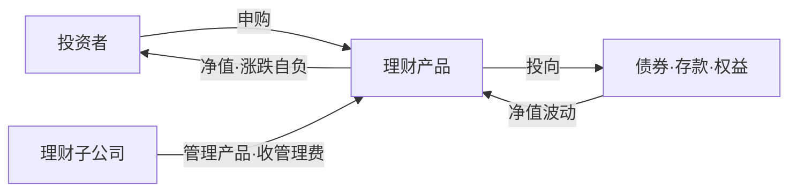

两处伏笔在这篇兑现：《银行业务入门》里说理财从「保本、表外资金池」走向「净值化」，《存款与账户入门》里说结构性存款和理财的分界是保本与否。这篇把理财讲清，顺便收拢第一篇埋的中间业务线索——银行不碰钱也能赚到的那些手续费。

生词随读随查配套的[《银行业务术语速查》](/posts/banking-glossary/)。

## 存款 vs 理财：债权与信托

存款是**债权**：银行欠你，利率约定好，银行担风险，存款保险兜 50 万。理财是**信托**：**代客理财、风险自担**——你委托银行理财子公司去投资，赚了是你的，亏了也是你的，银行只收管理费。

图里两条反向的线是全部要义：**净值波动**从标的传回投资者（风险流向），**管理费**从产品流向理财子公司（费用流向）。类比收尾：存款像数据库事务，存 1000 取 1000，银行兜底；理财像一支基金，按净值申购赎回，波动自负。

## 老模式为什么被禁

净值化之前的理财长这样：宣传保本，收益写「预期收益率」，背后是**资金池**——多只产品混在一起运作：资金滚动发行、资产集合运作、收益分离定价。新产品募来的钱可以拿去兑付到期产品（期限错配被藏起来），亏了银行垫（**刚性兑付**）。

问题在于：刚兑意味着风险根本没转移给投资者，只是淤积在银行体内；资金池意味着单只产品的风险根本算不清。两样都经不起审计，攒到一定规模就是系统性风险。资管新规要拆的就是这两样。

## 资管新规拆了什么

2018 年 4 月，四部门联合发布《关于规范金融机构资产管理业务的指导意见》，过渡期原定 2020 年底、后延至 2021 年底。核心动作四条：

- **打破刚兑**：不得承诺保本保收益，兑付困难不得垫资。
- **净值化**：收益随净值波动，「预期收益率」退出历史舞台。
- **三单**：每只产品单独管理、单独建账、单独核算——直接捅穿资金池。
- **去嵌套、限期限错配**：资管产品嵌套不得超过一层，非标资产到期日不得晚于产品到期日。

配套的组织动作是**理财子公司**：银行把理财业务整体搬进独立法人（2019 年 5 月首批工银理财、建信理财获批开业，五大行当年全部落地）。这就是「表外」在数据上的含义——理财资产的账不在银行核心系统，在子公司的系统里；银行资产负债表不再为理财兜底。

## 读懂一张理财说明书

- **风险等级 R1–R5**：从低到高五档，相对排序。买前先做风险测评，测评结果必须与产品等级匹配——R4 产品不会卖给测评出保守型的客户，这套机制叫适当性管理。
- **业绩比较基准 ≠ 承诺收益**：它只是参考锚，实际收益可能低于它。2022 年底债市大跌，大量 R2 固收理财破净、赎回潮形成负反馈——净值化的第一次全民教育：理财真的会亏。
- **估值方法**：摊余成本法（成本摊匀，净值平滑）与市值法（盯市，净值波动大），监管严格限制摊余成本法的适用范围。同类产品净值曲线不一样，根源常在这。
- **存款保险不覆盖理财**：50 万上限只保存款。理财出险，没有这层网。

## 表外与中间业务，收拢

第一篇说中间业务「不动自有资金、赚手续费」，现在可以数全了：

- **代销**：替基金公司、保险公司、别家理财子公司卖产品，赚佣金。投资风险不担，但担适当性责任——卖错了产品照样被追责。
- **托管**：保管资产、清算交收、监督投资用途，赚托管费，表外生意里最稳的一种。
- **担保承诺**：保函、信用证、贷款承诺——表外授信，收手续费，带或有风险（词典篇的或有负债在这里用上）。

共同点：不占或少占资本。回扣第一篇资本充足率那节——资本是稀缺品，所以银行爱做中间业务，监管也鼓励，逻辑闭环。

## 开发者视角

理财域系统与存款完全是两种脑子：

1. **销售系统**：适当性管理是主旋律——风险测评、等级匹配、销售双录（录音录像留痕），「适当性」在需求文档里的出现频率不亚于「账务」。
2. **估值核算系统**：给产品算净值。基金式估值会计——盯市、公允价值、估值表，和存款的摊余计息是两套会计思维。
3. **账不落银行核心**：产品的分户账、估值表都在理财子公司的系统里，银行渠道只是销售通道。「表外」在系统拓扑上的意思就是：另一套账。

## 小结

理财 = 信托关系（风险自担）+ 净值化（不得刚兑）+ 独立法人（表外另有账）。系列主线五篇至此收拢：**业务地图 → 支付清算 → 信贷 → 存款账户 → 理财表外**，配一册持续更新的术语词典。支线（二维码、CIPS、跨境支付）按需再补——读到黑话，随时丢给我。
